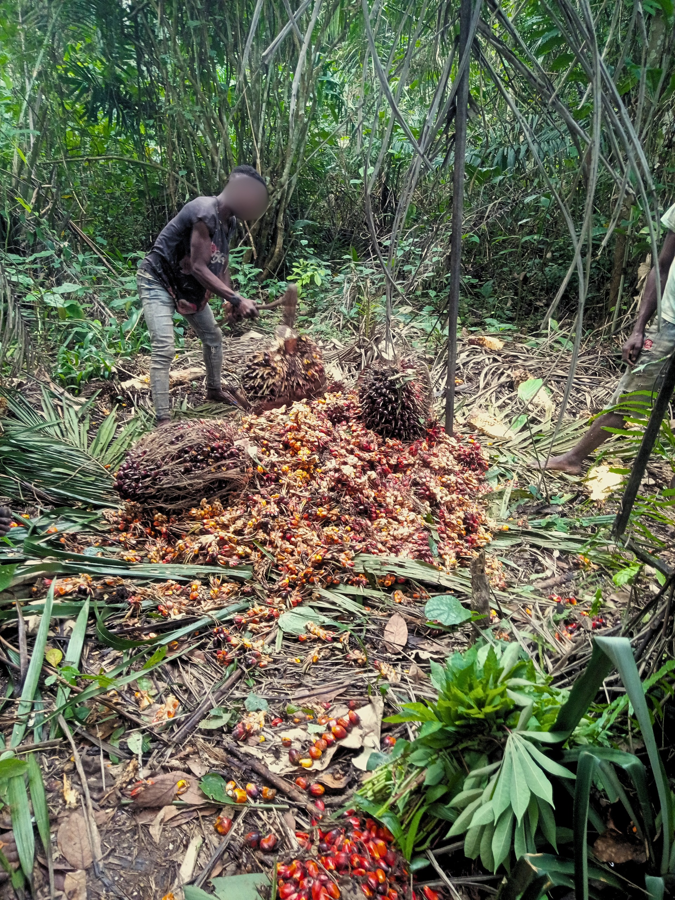

```{python}
#| label: setup
#| include: false

import pandas as pd
import xarray as xr
import numpy as np
import pymc as pm
import arviz as az
import matplotlib.pyplot as plt
import seaborn as sns
from pathlib import Path
from pyprojroot import here
import sys

sys.path.insert(0, str(here()))
from preprocessing import preprocess_data
from foraging_model.data import ForagingData
from foraging_model.model import ForagingModel
from foraging_model.priors import get_priors
from foraging_model.analytics import (
    load_or_build,
    per_forager_day_long,
    per_forager_summary,
)

RANDOM_SEED = 42
plt.style.use("seaborn-v0_8-whitegrid")
sns.set_palette("colorblind")
pd.set_option("display.max_columns", None)
```

## Software versions

```{python}
#| label: software-versions

import pytensor, scipy, nutpie

versions = {
    "pymc": pm.__version__,
    "pytensor": pytensor.__version__,
    "nutpie": nutpie.__version__,
    "arviz": az.__version__,
    "numpy": np.__version__,
    "pandas": pd.__version__,
    "xarray": xr.__version__,
    "scipy": scipy.__version__,
}
pd.DataFrame(
    [{"library": k, "version": v} for k, v in versions.items()]
)
```

## Data

### Preprocessing

The modelled dataset is constructed from six raw files: in-camp daily presence (`daysincamp.csv`), out-of-camp activity logs (`groups.csv`), weighed returns (`returns.csv`), recalled out-of-camp consumption (`recall.csv`), per-resource energy densities (`kcal.csv`), and camp roster with demographics (`camp_members.csv`). The preprocessing pipeline applies the following:

- Returns and recall combined. Foragers consume food acquired during foraging trips [@crittenden_juvenile_2013; @berbesque_eat_2016]; excluding it underestimates production. Both streams are merged into a single per-`pooled_group` × date production record.
- Group identifier. Each food package is identified by date and the set of contributing foragers. The `pooled_group` field from the field protocol resolves cases where multiple foragers participated in collecting the same item. We then aggregate to a single `group_id = "<date>_<sorted forager IDs>"`. When the same forager set is recorded against more than one `pooled_group` on the same day — e.g. two sub-trips, or two separately-pooled cooperative items — kcal is summed within the resulting `group_id` and the model treats them as a single observation in the LogNormal returns likelihood. Of 1 060 cooperative `group_id`s, 58 (5.5 %) merge two or more `pooled_group`s this way (max 7); solo `group_id`s never collide.
- Effort observations. For each forager × in-camp date, an effort indicator is set to 1 if the forager logged positive time on an out-of-camp trip with activity type "Foraging" that day (or contributed to a returned food package), and 0 otherwise. Of the 1 395 forager-days scored as effort = 1, 130 (9.3%) had no foraging-labelled trip that day and are credited solely through the forager's contribution to a returned food package. Multi-day trips are rare (36 of 2 683 logged trips) and are credited to the day of departure; subsequent days away are not counted as additional participation days. Trips logged with a non-foraging purpose (22% of trips) do not count toward effort in the canonical fit; the all-outings sensitivity variant (§ Sensitivity Analyses) relaxes this. These observations enter the Bernoulli effort component.
- Success observations. Conditional on having gone out, each forager × date is labelled as a success (returned with at least one food package) or failure. These observations enter the Bernoulli success component.
- Zero-inferred returns. (forager, date) pairs with positive out-of-camp time but no recorded food package are appended as kcal = 0 rows. These rows are excluded from the LogNormal returns component, which is conditional on positive returns. Foraging companions are recorded in the trip log, but production groups are keyed to the contributor sets of returned food packages; a trip that returns nothing produces no package, so there is no group contribution to a food package from which to build a cooperative record, and each zero-inferred row is entered as a solo trip. This misrepresents days on which the forager went out in a cooperative group that returned nothing.
- Age estimation. BaYaka birth years are not recorded numerically. Age was estimated using the consensus method of Diekmann et al., with 1-year intervals for individuals under 20 and 10-year intervals for those 20+. The model's measurement-error component places a Normal observation density on the recorded age centred on the latent true age (see §4.7), so we need an observation SD. The intervals are most naturally read as half-widths around a point estimate, so we use those half-widths directly as the Normal SD: `age_sigma` = 1 yr (under 20) and 5 yr (20+).
- Inclusion. Three of 54 listed camp members were excluded as under age 1; foragers without any foraging activity over the study window are then dropped at the time-aggregation step (two further age-1 toddlers). 49 foragers appear in the foraging-activity log; of those, 48 contributed at least one positive-kcal food package and inform the model. Two of the 49 are missing from the in-camp daily-presence file (`daysincamp.csv`) and so contribute no effort or success observations. One of these two nonetheless contributed to positive-kcal food packages and enters the returns likelihood (he is among the 48); the other went on one logged foraging trip but has no recorded food package, so he occupies a slot in the forager dimension without entering the likelihood. Figures throughout the manuscript and supplement therefore use $n = 48$.

```{python}
#| label: load-data
#| include: false

df_foragers, df_time_agg, df_production, df_days_long = preprocess_data(
    returns_file=here("raw_data/returns.csv"),
    recall_file=here("raw_data/recall.csv"),
    kcal_file=here("raw_data/kcal.csv"),
    group_file=here("raw_data/groups.csv"),
    camp_members_file=here("raw_data/camp_members.csv"),
    days_in_camp_file=here("raw_data/daysincamp.csv"),
    combine_returns_recall=True,
)
data = ForagingData(
    foragers_df=df_foragers,
    time_allocation_df=df_time_agg,
    production_df=df_production,
    days_in_camp_df=df_days_long,
    target_column="kcal",
    group_id_col="group_id",
    forager_id_col="id",
)
dataset = data.to_dataset()
```

### Resource Composition of Returns

```{python}
#| label: fig-resource-pie
#| fig-cap: "kcal distribution of food returned and recalled in the study. 'fish' contains one frog observation; 'game' covers mammals, birds, a turtle, and two lizards; 'cultivated tubers' is mostly cassava; 'cultivated fruit' covers citrus, papaya, cacao, and chilli peppers. BaYaka do not consume domesticated animals."

df_returns_raw = pd.read_csv(here("raw_data/returns.csv"))
df_recall_raw = pd.read_csv(here("raw_data/recall.csv"))
df_cat = pd.read_csv(here("raw_data/kcal_categories.csv"))
df_cat.columns = [c.strip() for c in df_cat.columns]

df_returns_raw.columns = [c.lower() for c in df_returns_raw.columns]
df_recall_raw.columns = [c.lower() for c in df_recall_raw.columns]
df_cat["Category"] = df_cat["Category"].astype(str).str.strip()
cat_lookup = df_cat.rename(columns={"Index": "index", "kcal.g": "kcal_g"})

# Per the data guide: when `pooled_group > 0`, the package weight
# (`net_food_weight_gram` for returns, `total_weight_grams` for recall)
# is the full group total repeated on every contributor's row, so we
# deduplicate cooperative rows to a single row per package before summing.
# When `pooled_group` is NaN/0 the row is a solo trip with a per-forager
# weight and we keep every row.
def _dedup_packages(df, weight_col):
    df = df.merge(cat_lookup[["index", "kcal_g", "Category"]], on="index", how="left")
    df["kcal_g"] = pd.to_numeric(df["kcal_g"], errors="coerce")
    df["total_kcal"] = df["kcal_g"] * df[weight_col]
    is_solo = df["pooled_group"].isna() | (df["pooled_group"] == 0)
    solo = df[is_solo]
    coop = df[~is_solo].drop_duplicates(subset=["date", "pooled_group"])
    return pd.concat([solo, coop], ignore_index=True)

df_ret = _dedup_packages(df_returns_raw, "net_food_weight_gram")
weight_col_rec = (
    "total_weight_grams" if "total_weight_grams" in df_recall_raw.columns
    else "x1_unit_weight_grams"
)
df_rec = _dedup_packages(df_recall_raw, weight_col_rec)

all_kcal = pd.concat(
    [df_ret[["Category", "total_kcal"]], df_rec[["Category", "total_kcal"]]],
    ignore_index=True,
).dropna(subset=["Category", "total_kcal"])

cat_totals = all_kcal.groupby("Category")["total_kcal"].sum().sort_values(ascending=False)
cat_pct = 100 * cat_totals / cat_totals.sum()

cmap = plt.colormaps.get_cmap("tab20")
colors = [cmap(i) for i in range(len(cat_totals))]

fig, ax = plt.subplots(figsize=(11, 6.5))
wedges, _ = ax.pie(
    cat_totals.values,
    labels=None,
    startangle=90,
    colors=colors,
    wedgeprops=dict(edgecolor="white", linewidth=1),
)
labels = [f"{name} — {pct:.1f}%" for name, pct in cat_pct.items()]
ax.legend(
    wedges, labels,
    title="Resource category (% of total kcal)",
    loc="center left",
    bbox_to_anchor=(1.02, 0.5),
    fontsize=10,
    title_fontsize=11,
    frameon=False,
)
ax.set_aspect("equal")
plt.tight_layout()
plt.show()
```

Game accounts for just 3.9% of kcal in the study: 73 returned package rows across 32 days, touched by 26 foragers. This is far too sparse to identify a hunting-specific three-parameter learning-senescence curve plus individual random effects, so no hunting-only refit is reported. The near-absence of hunting is itself informative — the age-related gains in production documented here arise almost entirely from gathered and collected resources, so they cannot be attributed to the long-delay proficiency profile that hunting-specific studies emphasize.

### Food-Package Group Sizes

```{python}
#| label: fig-group-size
#| fig-cap: "Distribution of the number of foragers contributing to each food package."

group_sizes = df_production[df_production["kcal"] > 0]["group_size"].astype(int).values

fig, ax = plt.subplots(figsize=(7, 4))
bins = np.arange(0.5, group_sizes.max() + 1.5)
ax.hist(group_sizes, bins=bins, edgecolor="black", color="#2E86AB", alpha=0.85)
ax.set_xlabel("Number of foragers in food package")
ax.set_ylabel("Number of food packages")
ax.set_xticks(np.arange(1, group_sizes.max() + 1))
plt.tight_layout()
plt.show()

print(
    f"n food packages = {len(group_sizes)} | "
    f"mean = {group_sizes.mean():.2f} | "
    f"SD = {group_sizes.std():.2f} | "
    f"median = {np.median(group_sizes):.0f} | "
    f"range = {group_sizes.min()}–{group_sizes.max()}"
)
```

## Causal DAG

The causal assumptions of the model are summarized in the following directed acyclic graph:

```{python}
#| label: fig-dag
#| fig-cap: "Causal DAG for food production model"

from IPython.display import Image, display
dag_path = Path(here()) / "img" / "dag.png"
if dag_path.exists():
    display(Image(filename=str(dag_path)))
```

Identification. Age affects both skill and effort. The skill curve and effort model condition on age. The bivariate Normal random effect on $(u_{\text{effort}},u_{\text{skill}})$ carries the residual covariance not captured by age; the joint distribution of effort, success, and returns identifies its correlation $\psi$. The covariance is estimated separately for men and women, yielding $\psi_{\text{male}}$ and $\psi_{\text{female}}$.

## Model Specification

The model has three components:

1. Effort (Bernoulli): P(subsistence trip | in camp)
2. Success (Bernoulli): P(returned with food | subsistence trip)
3. Returns (LogNormal): Group-level kcal $\log Y_g \sim \mathcal{N}(\log\mu_g,\sigma^2)$. The posterior variable ``shape`` is this $\sigma$.

### Skill Curve

Individual forager skill $S(x)$ depends on age $x$ via a learning-senescence parametrization (Koster et al. 2020):

$$S(x) = M(x) \cdot K(x)^b$$

where $M(x) = \exp(-m x)$ (senescence), $K(x) = 1 - \exp(-k x)$ (learning), and $b$ is the elasticity of skill on learning. Throughout, $x = \text{age}/A$ is age scaled by $A = \max_i \text{age}_i = 70$ yr; the rate parameters $m, k$ are in units of $1/x$. The PyMC code (`foraging_model/model.py`):

```{python}
#| eval: false
#| echo: true

# Per-forager rate parameters: log-scale population intercepts plus
# zero-sum gender offsets, then exponentiated for positivity.
m = pm.Deterministic("m", pt.exp(m0 + m0_gender[gender_idx]), dims="forager")
k = pm.Deterministic("k", pt.exp(k0 + k0_gender[gender_idx]), dims="forager")
b = pm.Deterministic("b", pt.exp(b0 + b0_gender[gender_idx]), dims="forager")

# Skill curve (uses scaled age = age / age_scale, age_scale = max age)
M_x      = pm.Deterministic("M",      pt.exp(-m * age), dims="forager")
K_x      = pm.Deterministic("K",      1 - pt.exp(-k * age), dims="forager")
S_x_base = pm.Deterministic("S_base", M_x * K_x ** b,   dims="forager")
# Multiplicative individual skill RE: S_i = S(x_i) * exp(u_skill_i)
S_x      = pm.Deterministic("S",      S_x_base * pt.exp(re_skill), dims="forager")
```

### Effort and Success Components

Both Bernoulli components use a logit link and additive random effects (on the latent scale). Effort uses a quadratic-in-(z-scored)-age fixed-effect:

$$\text{logit } P(\text{trip}_i \mid \text{in camp}) = \alpha^{\text{eff}}_{g(i)} + \beta^{\text{eff}}_{1,g(i)}\,z_i + \beta^{\text{eff}}_{2,g(i)}\,z_i^2 + u^{\text{eff}}_i + \delta^{\text{eff}}_t$$

where $g(i)$ is gender, $z_i = (x_i-\bar x)/\mathrm{sd}(x)$, $u^{\text{eff}}$ is the per-forager effort random effect, and $\delta^{\text{eff}}_t$ is the date random effect. Success uses a multiplicative-skill logit (success rate scales with the forager's age-and-RE-mediated skill):

$$\text{logit } P(\text{success}_{it} \mid \text{trip}) = \log\bigl(\alpha^{\text{succ}}_{g(i)} \cdot S_i^{\,\eta^{\text{succ}}_{g(i)}}\bigr) + \delta^{\text{succ}}_t$$

$\alpha^{\text{succ}}$ is a per-gender intercept and $\eta^{\text{succ}}$ is the elasticity of success probability on skill.

```{python}
#| eval: false
#| echo: true

# Effort: quadratic in z-scored age, gender offsets, individual RE, date RE
g_eff = gender_idx[effort_forager_idx]
effort_linear = (
    effort_intercept + effort_intercept_gender[g_eff]
    + (effort_age  + effort_age_gender[g_eff])  * age_z[effort_forager_idx]
    + (effort_age2 + effort_age2_gender[g_eff]) * age_z[effort_forager_idx] ** 2
    + re_effort[effort_forager_idx]
    + gp_effort[effort_date_idx]
)
pm.Bernoulli("effort", p=pt.sigmoid(effort_linear),
             observed=forager_effort, dims="effort_obs")

# Success: logit p = log(alpha * S^eta) + date RE
success_linear = (
    pt.log(S_x[forager_idx] ** eta_success[forager_idx]
           * alpha_success[forager_idx] + 1e-10)
    + gp_success[success_date_idx]
)
pm.Bernoulli("non_zero_prod", p=pt.sigmoid(success_linear),
             observed=forager_success, dims="forager_date")
```

### Correlated Random Effects

Random effects $(u_{\text{effort}}, u_{\text{skill}})$ for forager skill/effort follow a bivariate normal with LKJ prior on the correlation. The covariance is gender-stratified: men and women have separate $(\sigma_{\text{effort}}, \sigma_{\text{skill}}, \psi)$ so that the within-gender variability and the effort–skill correlation $\psi$ are estimated independently for each gender. Final skill: $S_i = S(x_i) \cdot \exp(u_{\text{skill},i})$.

```{python}
#| eval: false
#| echo: true

# Per-gender Cholesky-covariance for (effort, skill) random effects.
chol_male,   corr_male,   stds_male   = pm.LKJCholeskyCov(
    "chol_cov_male",   n=2, eta=self.priors["lkj_eta"],
    sd_dist=pm.Exponential.dist(lam=self.priors["sigma_re"]["lam"]),
    compute_corr=True,
)
chol_female, corr_female, stds_female = pm.LKJCholeskyCov(
    "chol_cov_female", n=2, eta=self.priors["lkj_eta"],
    sd_dist=pm.Exponential.dist(lam=self.priors["sigma_re"]["lam"]),
    compute_corr=True,
)
re_raw   = pm.Normal("re_raw", 0, 1, dims=("forager", "re_response"))
re_male  = pt.dot(re_raw, chol_male.T)
re_female = pt.dot(re_raw, chol_female.T)
re = pm.Deterministic(
    "re",
    pt.where(pt.eq(gender_idx[:, None], 0), re_male, re_female),
    dims=("forager", "re_response"),
)
re_effort = re[:, 0]
re_skill  = re[:, 1]
# psi_male   = corr_male[0, 1]
# psi_female = corr_female[0, 1]
```

### Date Random Effects

Day-to-day variation (weather, resource availability, group decisions) enters each component via date random effects, with one shared scale per component (effort, success, returns).

```{python}
#| eval: false
#| echo: true

# Date REs (canonical: use_gp = False). One scale per component.
gp_effort_raw  = pm.Normal("gp_effort_raw",  0, 1, dims="date")
gp_effort      = pm.Deterministic("gp_effort",
                                  gp_sigma_effort * gp_effort_raw, dims="date")
# (gp_success and gp_returns are constructed identically.)
```

### Aggregation

Group expected food production $\mu_g$ aggregates forager skills either as a mean or via best-top-$k$ (Hirshleifer 1983), which selects the subset of foragers maximising $g(k)\cdot\bar{S}_{g,k}^{\eta_\mu}$ over $k = 1,\dots,n_g$.

```{python}
#| eval: false
#| echo: true

# Best-top-k: sort skills, take cumulative top-k average, pick the k that
# maximises g(k) * mean_top_k(S)^eta_mu.  See model.py:_compute_group_mu_best_top_k.
g_k          = pt.exp(intercept_mu + b_groupsize_mu * pt.log(k_values))
top_k_means  = pt.cumsum(S_x_sorted * valid_mask, axis=1) / k_values
mu_by_k      = g_k[None, :] * (top_k_means ** eta_mu)
mu_best_topk = pt.max(mu_by_k, axis=1)

# Apply temporal effect, then LogNormal likelihood (the parameter named
# `shape` is the LogNormal sigma; kept under that name for backward
# compatibility with cached idata.nc).
mu = pm.Deterministic("mu",
                      mu_best_topk * pt.exp(gp_returns[group_date_idx]),
                      dims="group")
pm.LogNormal("kcal", mu=pt.log(pt.maximum(mu, 1e-10)),
             sigma=shape, observed=kcal, dims="group")
```

### Shapley Decomposition of Group Production

We attribute group-level kcal to individuals by computing Shapley values [@shapley_value_1953] under the fitted production function.

For a single food package (group $g$) with member set $N = \{1, \dots, n\}$ and posterior parameters $\theta = (\alpha_\mu, \beta, \eta_\mu, S_1, \dots, S_n)$, define the value function $v_\theta : 2^N \to \mathbb{R}_{\ge 0}$ by the same best-top-$k$ aggregation used in the returns likelihood:

$$v_\theta(S) \;=\; \begin{cases}\,\max\limits_{1 \le k \le |S|}\; \exp\bigl(\alpha_\mu + \beta\,\log k\bigr)\,\bigl(\overline{S}_{[k]}\bigr)^{\eta_\mu} & |S| \ge 1,\\[2pt] 0 & S = \varnothing.\end{cases}$$

In words: $v_\theta(S)$ is the model's prediction for "what would this subset of foragers have produced." Choosing the subset size $k$ that maximises predicted output (the best-top-$k$ rule), so $v_\theta(S)$ is the highest output achievable using any $k$-member team drawn from $S$. Adding a new forager to $S$ can only raise this maximum (they become an additional candidate), so $v_\theta$ is monotone, and $v_\theta(\varnothing) = 0$. The grand-coalition value $v_\theta(N) = \mu_g$ is the model's posterior median kcal for the actual group on that day.

The Shapley value of player $i$ in $v_\theta$ is

$$\phi_i(v_\theta) \;=\; \sum_{S \subseteq N \setminus \{i\}} \frac{|S|!\,(n-|S|-1)!}{n!}\,\bigl[v_\theta(S \cup \{i\}) - v_\theta(S)\bigr]
\;=\; \frac{1}{n!}\sum_{\pi \in \mathcal{S}_N} \bigl[v_\theta(P_\pi^i \cup \{i\}) - v_\theta(P_\pi^i)\bigr],$$

where $\mathcal{S}_N$ is the set of all $n!$ orderings of $N$ and $P_\pi^i$ is the set of players preceding $i$ in $\pi$. Imagine the foragers joining the group one at a time in a random order; $\phi_i$ is the average extra kcal that adding forager $i$ contributes when they join.

The Shapley value is the unique allocation rule satisfying [@shapley_value_1953]:

- Efficiency: $\sum_{i \in N} \phi_i(v) = v(N)$. Shares add up to the group total.
- Symmetry: if $v(S \cup \{i\}) = v(S \cup \{j\})$ for every $S \subseteq N \setminus \{i, j\}$, then $\phi_i(v) = \phi_j(v)$. Foragers with identical marginal contributions get equal credit.
- Null player: if $v(S \cup \{i\}) = v(S)$ for every $S \subseteq N \setminus \{i\}$, then $\phi_i(v) = 0$. A forager who never adds anything gets nothing.
- Linearity: $\phi_i(av + bv') = a\,\phi_i(v) + b\,\phi_i(v')$. Decomposition commutes with linear combinations of games — the property we lean on for the per-group rescaling below.

We compute $\phi_i(v_\theta)$ for every posterior draw $\theta^{(s)}$ and every group $g$.

#### Per-group rescaling to observed kcal

The raw Shapley value $\phi_i(v_\theta)$ is anchored to the model's predicted median $\mu_g$, in scaled-kcal units. To convert it into a kcal share of what the group actually brought back that day, we apply three per-group scalar multiplications:

1. Unit rescaling: multiply by `kcal_scale` to return to original kcal units.
2. Date random effect: multiply by $\exp(\delta^{\text{ret},(s)}_{t_g})$, the per-sample posterior of the date RE on returns at the group's date $t_g$. This adjusts for whether the day was unusually good or bad overall.
3. Proportional residual: rescale each per-sample contribution by $Y_g^{\text{obs}} / \sum_j \phi_j^{(s)}$. Each forager's attribution becomes their per-sample Shapley share $\pi_i^{(s)} \equiv \phi_i^{(s)} / \sum_j \phi_j^{(s)}$ multiplied by the observed group total: $\tilde\phi_i^{(s)} = \pi_i^{(s)}\, Y_g^{\text{obs}}$.

After step 3, the rescaled allocation $\tilde\phi^{(s)}$ is no longer the Shapley value of $v_\theta$ — it is the Shapley share of $v_\theta$ scaled to the observed total $Y_g^{\text{obs}}$. Equivalently, it is the Shapley value of the rescaled game $\tilde v^{(s)}_\theta(S) = v_\theta(S) \cdot Y_g^{\text{obs}} / v_\theta(N)$, which is well-defined whenever $v_\theta(N) > 0$ (the case for every fitted positive-return group). Because $\tilde v$ is $v_\theta$ multiplied by the constant $Y_g^{\text{obs}} / v_\theta(N)$ at the per-group, per-sample level, linearity of the Shapley value gives $\phi_i(\tilde v) = (Y_g^{\text{obs}} / v_\theta(N))\,\phi_i(v_\theta)$, and efficiency, symmetry, null player, and linearity all carry over to the rescaled game within the group.

#### Computation

For $n \le 15$ we enumerate all $2^n$ subsets exactly, computing $v_\theta(S)$ once per subset and combining via the $|S|!(n-|S|-1)!/n!$ weights from the closed-form expression. For $n > 15$ we fall back on single-permutation Monte Carlo: for each posterior sample we draw one ordering $\pi$ uniformly at random and assign each player their marginal contribution under $\pi$. Averaging this estimator over orderings recovers $\phi_i(v_\theta)$ in expectation [@castro_polynomial_2009]. With our group-size distribution (max $n = 17$; see Section 2), the exact engine handles 1 069 of 1 070 positive-return groups; one group falls back to single-permutation MC.

Decomposition is at the food-package level (one computation per positive-return group); per-forager daily contributions sum the rescaled $\tilde\phi_i^{(s)}$ across every group the forager participated in on a given date. Two denominators are used downstream: foraging days (effort = 1; failed trips enter as 0 kcal) and in-camp days (every in-camp day, with non-foraging days and failed trips both 0 kcal).

```{python}
#| eval: false
#| echo: true

# Shapley computation (foraging_model/counterfactuals.py): exact engine
# for n ≤ 15, joint MC otherwise; vectorised across posterior samples.
n_factorial = math.factorial(n)
mu_cache = {  # mu(S) cached once per subset (size 2**n)
    frozenset(sub): _compute_mu_for_subset_vectorized(
        list(sub), S_x, intercept_mu, b_groupsize_mu, eta_mu,
    )
    for size in range(n + 1) for sub in combinations(group_members, size)
}
shapley = np.zeros((n_samples, n))
for member in group_members:
    others = [m for m in group_members if m != member]
    for s in range(n):                       # subset size |S|
        w = math.factorial(s) * math.factorial(n - s - 1) / n_factorial
        for sub in combinations(others, s):   # iterate S ⊆ N\{i}
            T = frozenset(sub); T1 = T | {member}
            shapley[:, member_to_idx[member]] += w * (mu_cache[T1] - mu_cache[T])

# Per-group scalar adjustments — all axiom-preserving:
shapley *= kcal_scale                                          # back to kcal units
shapley *= np.exp(sigma_kcal ** 2 / 2)[:, None]                # LogNormal mean correction
shapley *= np.exp(gp_returns[date_g])[:, None]                  # date RE multiplier
shapley *= (Y_obs[g] / shapley.sum(axis=1))[:, None]            # proportional to observed
```

### Latent Age (Measurement Error)

Forager age is treated as a latent variable. We place a uniform prior on the true age $x_i$ over a plausible range and treat the recorded age $\text{age}_{\text{obs},i}$ as a noisy Gaussian observation:

$$x_i \sim \mathrm{Uniform}(1, 80), \qquad \text{age}_{\text{obs},i} \sim \mathcal{N}(x_i,\ \sigma_{\text{age},i}^2).$$

We use $\sigma_{\text{age}} = 1$ yr for ages $< 20$ and $\sigma_{\text{age}} = 5$ yr for ages $\geq 20$, reflecting the larger uncertainty in age estimation for adults. All age-dependent quantities ($S(x_i)$, the effort polynomial in age) are evaluated at $x_i$, propagating age uncertainty into the posteriors.

```{python}
#| eval: false
#| echo: true

age_true = pm.Uniform(
    "age_true", lower=1.0, upper=80.0, dims="forager",
)
pm.Normal(
    "age_obs", mu=age_true, sigma=age_sigma,
    observed=age_raw, dims="forager",
)
# Both the skill curve and the effort polynomial use age_true downstream.
```

### Model graph

The full PyMC computation graph for the fit reported in the main text is shown below. Plate notation: rectangles enclose the dimensions over which a node is replicated (foragers, groups, dates, forager-date observations). Hatched ellipses are observed nodes; unhatched ellipses are latent; rectangles with rounded corners are deterministic transforms.

```{python}
#| label: build-canonical-model
#| include: false

foraging_model = ForagingModel(
    data=dataset,
    aggregation_method="best_top_k",
    target_scaling="mean",
    age_scaling="max",
    measurement_error_age=True,
    use_gp=False,
)
```

{#fig-model-graph .lightbox fig-align="center" width="100%" group="model-graph"}

## Priors

```{python}
#| label: load-canonical-idata
#| include: false

results_dir = Path(here()) / "results"
CANONICAL_VARIANT = "ln_nogp_meage_long"
idata_path = results_dir / CANONICAL_VARIANT / "idata.nc"
if idata_path.exists():
    idata = az.from_netcdf(idata_path)
else:
    idata = None


def _skill_params(post):
    return (np.exp(post["m0"].values.flatten()),
            np.exp(post["k0"].values.flatten()),
            np.exp(post["b0"].values.flatten()),
            float(post.attrs.get("age_scale", 70.0)))


def peak_skill_age(post):
    """Posterior of the age at which S(x) peaks, in years.

    Analytical (dS/dx = 0 => x* = (1/k) log(1 + bk/m)), matching
    scripts/extract_results.py. A grid search truncates the upper tail under
    the wide-prior variants, where a small fraction of draws peak beyond
    80 years.
    """
    m, k, b, a_scale = _skill_params(post)
    return (1 / k) * np.log1p(b * k / m) * a_scale


def age_at_half_peak(post):
    """Posterior of the age at which S(x) first reaches half its peak."""
    m, k, b, a_scale = _skill_params(post)
    x_peak = (1 / k) * np.log1p(b * k / m)
    S_peak = np.exp(-m * x_peak) * (1 - np.exp(-k * x_peak)) ** b
    grid = np.linspace(0.5, 80, 1600) / a_scale
    S = np.exp(-np.outer(m, grid)) * np.clip(
        1 - np.exp(-np.outer(k, grid)), 1e-10, 1) ** b[:, None]
    reached = S >= (S_peak[:, None] / 2)
    return np.where(reached.any(axis=1),
                    grid[reached.argmax(axis=1)] * a_scale, np.nan)
```

Prior specification (from model config):

```{python}
#| label: prior-table
#| tbl-cap: "Prior specifications"

priors = get_priors()
# The canonical fit uses independent date REs (use_gp=False); gp_lengthscale
# is only sampled when the GP variant is fit, so suppress it from this table.
# The gp_sigma_* priors are reused as the date-RE scale in the no-GP variant
# and remain in the table.
GP_ONLY = {"gp_lengthscale"}
LABEL_OVERRIDES = {
    "gp_sigma_effort":  "sigma_date_effort  (date RE scale, effort)",
    "gp_sigma_success": "sigma_date_success (date RE scale, success)",
    "gp_sigma_returns": "sigma_date_returns (date RE scale, returns)",
}
rows = []
for name, spec in priors.items():
    if name in GP_ONLY:
        continue
    label = LABEL_OVERRIDES.get(name, name)
    if isinstance(spec, dict):
        dist = spec.get("dist", "normal").capitalize()
        params = ", ".join(f"{k}={v}" for k, v in spec.items() if k != "dist")
        rows.append({"Parameter": label, "Distribution": dist, "Parameters": params})
    else:
        rows.append({"Parameter": label, "Distribution": "scalar", "Parameters": str(spec)})
pd.DataFrame(rows)
```

### Skill-curve priors derived from Koster et al. (2020)

The skill-curve location and rate parameters $(m_0, k_0, b_0)$ are not given off-the-shelf weakly informative priors. We instead use cross-cultural informative priors derived from @koster_life_2020 — a Stan model fit jointly to data on 1 821 hunters across 40 sites, using the same learning–senescence functional form $S(x) = \exp(-mx)\,(1 - \exp(-kx))^b$. We extract the global posterior over $(\log m, \log k, \log b)$ and the between-site SDs from Koster's published `model_fix_17092018.RData` (OSF: `osf.io/2kzb6`, 1 600 posterior draws) and combine them as

$$\sigma_{\text{prior}} = \sqrt{\sigma_{\text{global mean}}^2 + \sigma_{\text{between site}}^2}$$

so that a new site (the BaYaka camp during this study period) is allowed to land anywhere in the cross-cultural distribution that Koster's data has so far seen. Because Koster's reference age is 80 yr while our `age_scale` is 70 yr, we shift $\log m$ and $\log k$ by $\log(70/80) \approx -0.134$ before using them as priors (the elasticity $b$ is unitless and unaffected). The exact derivation is in `scripts/_derive_priors.py`, with resulting priors recorded in `foraging_model/cross_cultural_priors.json`.

```{python}
#| label: tbl-koster-priors
#| tbl-cap: "Skill-curve informative priors derived from Koster et al. (2020). The location is the global posterior mean of (log m, log k, log b) on the cross-cultural Stan fit; the scale combines uncertainty about the global mean with the empirical between-site SD."

import json
with open(here("foraging_model/cross_cultural_priors.json")) as _f:
    _kp = json.load(_f)
pd.DataFrame([
    {
        "Parameter": p,
        "Prior": f"Normal({_kp['priors'][p]['mu']}, {_kp['priors'][p]['sigma']})",
        "Description": _kp["priors"][p]["description"].replace("²", "²"),
    }
    for p in ("m0", "k0", "b0")
])
```

We additionally use Koster et al.'s (2020) cross-cultural posterior on the skill–success and skill–harvest elasticities to anchor our $\eta_{\mu,0}$ and $\eta_{\text{success},0}$ priors. Koster's per-society parameters `seh` (harvest skill elasticity) and `sef` (failure skill elasticity) are log-scale exponents on the per-hunter skill in their Stan model (`raw_data/model_fix.stan`) — comparable to our $\eta_{\mu,0}$ for harvest and (by interpretation, with consistent sign) to our $\eta_{\text{success},0}$ for success. We pool the (society × draw) posterior to summarise the cross-cultural distribution and use its mean and SD as a $\text{Normal}(\mu, \sigma)$ prior:

```{python}
#| label: tbl-koster-elasticity-priors
#| tbl-cap: "Elasticity priors derived from Koster et al. (2020). Mean and SD are the global pooled (40 societies × 1600 draws) summary of the per-society elasticity posterior."

pd.DataFrame([
    {
        "Parameter": p,
        "Prior": f"Normal({_kp['priors'][p]['mu']}, {_kp['priors'][p]['sigma']})",
        "Description": _kp["priors"][p]["description"].replace("²", "²"),
    }
    for p in ("eta_mu0", "eta_success0") if p in _kp.get("priors", {})
])
```

### Prior predictive check

Drawing observables from the prior shows the range of behaviour the prior alone admits.

```{python}
#| label: fig-prior-predictive
#| fig-cap: "Prior predictive checks. Top: ECDF of returns kcal on a log-x axis (observed in black; prior-predictive replicates in pale blue). Bottom-left: marginal P(subsistence trip) — observed value vs. prior-predictive distribution. Bottom-right: marginal P(success | trip)."

if idata is not None and "prior_predictive" in idata.groups():
    pp_prior = idata.prior_predictive
    obs = idata.observed_data
    rng = np.random.default_rng(0)

    fig, axes = plt.subplots(2, 2, figsize=(12, 8))

    # --- Returns: ECDF on log-kcal ---
    obs_kcal = np.asarray(obs["kcal"].values, dtype=float)
    obs_kcal = obs_kcal[obs_kcal > 0]
    pp_kcal = pp_prior["kcal"].values.reshape(-1, pp_prior["kcal"].shape[-1])
    n_rep = min(200, pp_kcal.shape[0])
    idx = rng.choice(pp_kcal.shape[0], n_rep, replace=False)

    ax = axes[0, 0]
    sort_obs = np.sort(obs_kcal)
    ecdf_obs = np.arange(1, len(sort_obs) + 1) / len(sort_obs)
    for j in idx:
        d = pp_kcal[j]
        d = d[d > 0]
        if len(d) == 0:
            continue
        s = np.sort(d)
        e = np.arange(1, len(s) + 1) / len(s)
        ax.plot(s, e, color="#1B5E8C", alpha=0.06, lw=0.7)
    ax.plot(sort_obs, ecdf_obs, color="black", lw=2.0, label="Observed")
    ax.plot([], [], color="#1B5E8C", lw=1.0, alpha=0.6,
            label="Prior predictive")
    ax.set_xscale("log")
    ax.set_xlabel("kcal")
    ax.set_ylabel("ECDF")
    ax.set_title("Returns: ECDF")
    ax.legend(loc="lower right", frameon=False, fontsize=9)

    axes[0, 1].axis("off")

    # --- Effort: marginal P(trip) ---
    ax = axes[1, 0]
    obs_eff = np.asarray(obs["effort"].values, dtype=float)
    pp_eff = pp_prior["effort"].values.reshape(-1, pp_prior["effort"].shape[-1])
    obs_p = obs_eff.mean()
    pp_p = pp_eff.mean(axis=1)
    ax.hist(pp_p, bins=40, color="#1B5E8C", alpha=0.5,
            label="Prior predictive")
    ax.axvline(obs_p, color="black", lw=2.0, label="Observed")
    ax.set_xlabel("Marginal P(subsistence trip)")
    ax.set_ylabel("Prior frequency")
    ax.set_title("Effort")
    ax.legend(loc="upper right", frameon=False, fontsize=9)

    # --- Success: marginal P(success | trip) ---
    ax = axes[1, 1]
    if "non_zero_prod" in pp_prior.data_vars and "non_zero_prod" in obs.data_vars:
        obs_s = np.asarray(obs["non_zero_prod"].values, dtype=float)
        pp_s = pp_prior["non_zero_prod"].values.reshape(
            -1, pp_prior["non_zero_prod"].shape[-1]
        )
        obs_p = obs_s.mean()
        pp_p = pp_s.mean(axis=1)
        ax.hist(pp_p, bins=40, color="#1B5E8C", alpha=0.5,
                label="Prior predictive")
        ax.axvline(obs_p, color="black", lw=2.0, label="Observed")
        ax.set_xlabel("Marginal P(success | trip)")
        ax.set_ylabel("Prior frequency")
        ax.set_title("Success")
        ax.legend(loc="upper right", frameon=False, fontsize=9)
    else:
        ax.axis("off")

    for ax in axes.ravel():
        for spine in ("top", "right"):
            ax.spines[spine].set_visible(False)

    plt.tight_layout()
    plt.show()
```

The prior-predictive distributions for the returns ECDF and the two Bernoulli marginals all envelope the observed values comfortably — the priors admit the observed regime without being implausibly wide.

## Model checking

The fit reported in the main text uses NUTS via the [nutpie](https://github.com/pymc-devs/nutpie) sampler (JAX backend), six chains × 2 000 warm-up + 5 000 sampling iterations, target acceptance 0.95.

```{python}
#| label: tbl-diagnostics-summary
#| tbl-cap: "Sampler convergence summary for the fit reported in the main text. ESS bulk and R-hat are summarised across all free random variables."

if idata is not None and "posterior" in idata:
    summary = az.summary(
        idata,
        var_names=[v.name for v in foraging_model.model.free_RVs],
    )
    n_div = int(idata.sample_stats.diverging.sum().values)
    diag = pd.DataFrame([{
        "Divergences": n_div,
        "ESS bulk (min)": int(summary["ess_bulk"].min()),
        "ESS bulk (median)": int(summary["ess_bulk"].median()),
        "ESS tail (min)": int(summary["ess_tail"].min()),
        "R-hat (max)": round(float(summary["r_hat"].max()), 4),
        "n parameters": len(summary),
    }])
    diag.T.rename(columns={0: "value"})
```

```{python}
#| label: fig-traceplots
#| fig-cap: "Trace plots for every scalar population-level parameter. Left column: posterior density per chain. Right column: per-iteration trace per chain. Six chains × 5 000 post-warm-up iterations."
#| fig-width: 11
#| fig-height: 22

if idata is not None and "posterior" in idata:
    POP_VARS = [
        # Skill curve
        "m0", "k0", "b0",
        # Returns / Gamma component
        "intercept_mu", "b_groupsize_mu0", "eta_mu0", "shape",
        # Success
        "intercept_success", "eta_success0",
        # Effort polynomial
        "effort_intercept", "effort_age", "effort_age2",
        # Date REs (no GP variant)
        "gp_sigma_effort", "gp_sigma_success", "gp_sigma_returns",
    ]
    pop_vars = [v for v in POP_VARS if v in idata.posterior.data_vars]
    az.plot_trace(idata, var_names=pop_vars, compact=False)
    plt.tight_layout()
    plt.show()
```

For per-observation predictive accuracy and influential-observation detection we use Pareto-smoothed importance-sampling leave-one-out cross-validation (PSIS-LOO; @vehtari_practical_2017), as implemented by `az.loo`. The shape parameter $\hat k$ of that Pareto fit is itself a diagnostic: $\hat k < 0.7$ indicates the importance-sampling estimate of the LOO log-density for that observation is reliable; $\hat k > 0.7$ flags observations where the leave-one-out posterior differs substantially from the full posterior, so the approximation may be unreliable and the observation is exerting outsized influence on the fit.

```{python}
#| label: fig-pareto-k
#| fig-cap: "Pareto-$\\hat{k}$ diagnostic from PSIS-LOO (Vehtari et al. 2017) on the kcal observable. Each point is a group-level kcal observation; values above the 0.7 reference line flag observations whose leave-one-out importance-sampling estimate is unreliable and which may be exerting outsized influence on the fit."
#| fig-width: 8
#| fig-height: 4

if idata is not None and "log_likelihood" in idata:
    fig, ax = plt.subplots(figsize=(8, 4))
    try:
        loo_result = az.loo(idata, pointwise=True, var_name="kcal")
        az.plot_khat(loo_result, ax=ax)
        ax.set_title("Pareto-$\\hat{k}$ (PSIS-LOO, kcal)")
    except Exception as e:
        ax.text(0.5, 0.5, f"LOO unavailable\n{e}", ha="center", va="center")
        ax.axis("off")
    plt.tight_layout()
    plt.show()
```

### Posterior predictive check

```{python}
#| label: fig-ppc
#| fig-cap: "Posterior predictive checks. Top row (returns component): ECDF on log-x and LOO-PIT ECDF difference (deviation of the leave-one-out probability-integral transform from uniform; the shaded band is the 94% credible region under perfect calibration). Bottom row (Bernoulli components): posterior distributions of the marginal trip- and success-rates against the observed marginal. Black: observed; blue: posterior-predictive replicates."

if idata is not None and "posterior_predictive" in idata.groups():
    pp = idata.posterior_predictive
    obs = idata.observed_data
    rng = np.random.default_rng(0)

    fig, axes = plt.subplots(2, 2, figsize=(12, 8))

    obs_kcal = np.asarray(obs["kcal"].values, dtype=float)
    obs_kcal = obs_kcal[obs_kcal > 0]
    pp_kcal = pp["kcal"].values.reshape(-1, pp["kcal"].shape[-1])
    n_rep = 200
    idx = rng.choice(pp_kcal.shape[0], n_rep, replace=False)

    # --- Returns: ECDF on log-kcal ---
    ax = axes[0, 0]
    sort_obs = np.sort(obs_kcal)
    ecdf_obs = np.arange(1, len(sort_obs) + 1) / len(sort_obs)
    for j in idx:
        d = pp_kcal[j]
        d = d[d > 0]
        if len(d) == 0:
            continue
        s = np.sort(d)
        e = np.arange(1, len(s) + 1) / len(s)
        ax.plot(s, e, color="#1B5E8C", alpha=0.06, lw=0.7)
    ax.plot(sort_obs, ecdf_obs, color="black", lw=2.0, label="Observed")
    ax.plot([], [], color="#1B5E8C", lw=1.0, alpha=0.6,
            label="Posterior predictive")
    ax.set_xscale("log")
    ax.set_xlabel("kcal")
    ax.set_ylabel("ECDF")
    ax.set_title("Returns: ECDF")
    ax.legend(loc="lower right", frameon=False, fontsize=9)

    # --- Returns: LOO-PIT ECDF difference ---
    ax = axes[0, 1]
    if "log_likelihood" in idata.groups():
        try:
            az.plot_loo_pit(idata=idata, y="kcal", ecdf=True,
                            hdi_prob=0.95, ax=ax)
            ax.set_title("Returns: LOO-PIT ECDF difference")
        except Exception as e:
            ax.text(0.5, 0.5, f"LOO-PIT unavailable\n{e}",
                    ha="center", va="center", fontsize=9)
            ax.axis("off")
    else:
        ax.axis("off")

    # --- Effort: Bernoulli proportion histogram ---
    ax = axes[1, 0]
    obs_eff = np.asarray(obs["effort"].values, dtype=float)
    pp_eff = pp["effort"].values.reshape(-1, pp["effort"].shape[-1])
    obs_p = obs_eff.mean()
    pp_p = pp_eff.mean(axis=1)
    ax.hist(pp_p, bins=40, color="#1B5E8C", alpha=0.5,
            label="Posterior predictive")
    ax.axvline(obs_p, color="black", lw=2.0, label="Observed")
    ax.set_xlabel("Marginal P(subsistence trip)")
    ax.set_ylabel("Posterior frequency")
    ax.set_title("Effort")
    ax.legend(loc="upper right", frameon=False, fontsize=9)

    # --- Success: Bernoulli proportion histogram ---
    ax = axes[1, 1]
    if "non_zero_prod" in pp.data_vars and "non_zero_prod" in obs.data_vars:
        obs_s = np.asarray(obs["non_zero_prod"].values, dtype=float)
        pp_s = pp["non_zero_prod"].values.reshape(-1, pp["non_zero_prod"].shape[-1])
        obs_p = obs_s.mean()
        pp_p = pp_s.mean(axis=1)
        ax.hist(pp_p, bins=40, color="#1B5E8C", alpha=0.5,
                label="Posterior predictive")
        ax.axvline(obs_p, color="black", lw=2.0, label="Observed")
        ax.set_xlabel("Marginal P(success | trip)")
        ax.set_ylabel("Posterior frequency")
        ax.set_title("Success")
        ax.legend(loc="upper right", frameon=False, fontsize=9)
    else:
        ax.axis("off")

    for ax in axes.ravel():
        for spine in ("top", "right"):
            ax.spines[spine].set_visible(False)

    plt.tight_layout()
    plt.show()
```

### Returns residuals against covariates

Log-scale residuals on the kcal observation, $r_g = \log Y_g^{\text{obs}} - \widehat{\log\mu_g}$, where $\widehat{\log\mu_g}$ is the posterior mean of the LogNormal location for group $g$. Under correct specification the residuals should look like mean-zero noise across all covariates. We plot one residual per group against (i) the model's predicted log kcal, (ii) the mean age of the contributing foragers, and (iii) group size. The dashed band is $\pm 2\hat\sigma$, where $\hat\sigma$ is the posterior mean of the LogNormal scale.

```{python}
#| label: fig-returns-residuals
#| fig-cap: "Log-scale residuals for the LogNormal returns component (one point per group, n = 1 070), plotted against predicted log kcal (left), mean age of contributing foragers (centre), and group size (right). Dashed lines mark $\\pm 2\\hat\\sigma$ from the posterior mean of the LogNormal scale."
#| fig-width: 13
#| fig-height: 4

if idata is not None and "posterior" in idata:
    post = idata.posterior
    kcal_scale = float(post.attrs.get("kcal_scale", 1.0))
    # Observed kcal is stored on the raw scale (post-rescaling); `mu` is on
    # the scaled-kcal scale (the LogNormal location is `log(mu)`). Convert
    # observed to the scaled scale for like-for-like residuals.
    y_obs = np.asarray(idata.observed_data["kcal"].values, dtype=float)
    log_mu_hat = np.log(np.maximum(
        post["mu"].mean(dim=("chain", "draw")).values, 1e-12
    ))
    log_y_scaled = np.log(np.maximum(y_obs / kcal_scale, 1e-12))
    res = log_y_scaled - log_mu_hat
    sigma_hat = float(post["shape"].mean(dim=("chain", "draw")).values)

    fids_padded = idata.constant_data["forager_ids"].values
    gs_arr = (fids_padded >= 0).sum(axis=1)
    age_obs = idata.observed_data["age_obs"].values
    age_per_group = np.array([
        age_obs[fids_padded[g, fids_padded[g] >= 0]].mean() for g in range(len(y_obs))
    ])

    fig, axes = plt.subplots(1, 3, figsize=(13, 4), sharey=True)
    for ax, x, xlabel in [
        (axes[0], log_mu_hat,    "Predicted log kcal"),
        (axes[1], age_per_group, "Mean age of contributing foragers (yr)"),
        (axes[2], gs_arr,        "Group size"),
    ]:
        ax.scatter(x, res, s=12, color="#1B5E8C", alpha=0.45,
                   edgecolor="white", linewidth=0.3)
        ax.axhline(0, color="black", lw=0.6, ls="-", zorder=0)
        ax.axhline(+2 * sigma_hat, color="black", lw=0.6, ls="--", zorder=0)
        ax.axhline(-2 * sigma_hat, color="black", lw=0.6, ls="--", zorder=0)
        ax.set_xlabel(xlabel)
        for sp in ("top", "right"): ax.spines[sp].set_visible(False)
    axes[0].set_ylabel(r"$\log Y^{\mathrm{obs}}_g - \widehat{\log\mu_g}$")
    plt.tight_layout()
    plt.show()
```

### Autocorrelation of within-forager Shapley contributions

The model assumes per-forager daily kcal contributions are conditionally independent. If a forager's daily Shapley-attributed kcal carries within-forager temporal structure beyond the shared date RE, that would show up as non-zero autocorrelation in the residual sequence. We compute the sample autocorrelation of each forager's daily Shapley-attributed kcal across their consecutive in-camp days (non-foraging days entered as 0 kcal). Calendar gaps between in-camp stints are not adjusted for, so the ACF is over consecutive in-camp-day index.

```{python}
#| label: fig-shapley-acf
#| fig-cap: "Within-forager autocorrelation of daily Shapley-attributed kcal across consecutive in-camp days (non-foraging days entered as 0 kcal). Coloured lines: per-forager ACFs, one line per forager with at least nine in-camp days (n = 45 of the 48 modeled foragers; the lag-7 ACF requires nine days, which excludes two foragers with shorter in-camp records and one missing from the daily-presence file). Black: median ACF across foragers. Shaded band: pointwise 5–95 percentile across foragers. Dashed lines mark $\\pm 2/\\sqrt{\\bar n}$ as a rough 95% reference for the per-forager ACF under the white-noise null, where $\\bar n$ is the median per-forager number of in-camp days."
#| fig-width: 9
#| fig-height: 5

ds_acf = load_or_build()
kcal_arr = ds_acf["kcal_attributed"].values  # (forager, date), 0 on non-foraging days
in_camp_arr = ds_acf["in_camp"].values
sex_arr_acf = np.asarray(ds_acf["sex"].values)
SEX_COLOR = {"male": "#2E86AB", "female": "#E94F37"}

MAX_LAG = 7

def _acf(x, max_lag):
    x = x[np.isfinite(x)]
    n = len(x)
    if n < max_lag + 2:
        return np.full(max_lag + 1, np.nan)
    x = x - x.mean()
    var = float((x * x).sum())
    if var == 0:
        return np.full(max_lag + 1, np.nan)
    out = np.empty(max_lag + 1)
    for lag in range(max_lag + 1):
        out[lag] = float((x[: n - lag] * x[lag:]).sum() / var)
    return out

acfs = []
ns = []
for f in range(kcal_arr.shape[0]):
    # ACF over the in-camp window, with non-foraging days as 0.
    # This captures next-day-after-bonanza rest behaviour that would
    # be invisible if we restricted to foraging days only.
    series = kcal_arr[f][in_camp_arr[f]]
    acfs.append(_acf(series, MAX_LAG))
    ns.append(int(in_camp_arr[f].sum()))
acfs = np.array(acfs)
ns = np.array(ns)
n_bar = int(np.median(ns[ns > 0]))
band = 2.0 / np.sqrt(max(n_bar, 1))

fig, ax = plt.subplots(figsize=(9, 5))
lags = np.arange(1, MAX_LAG + 1)  # drop lag 0 (always 1)
for f, sex_v in enumerate(sex_arr_acf):
    a = acfs[f, 1:]
    if not np.any(np.isfinite(a)):
        continue
    ax.plot(lags, a, color=SEX_COLOR.get(str(sex_v), "gray"),
            alpha=0.20, lw=0.8)
median_acf = np.nanmedian(acfs[:, 1:], axis=0)
lo = np.nanpercentile(acfs[:, 1:], 5, axis=0)
hi = np.nanpercentile(acfs[:, 1:], 95, axis=0)
ax.fill_between(lags, lo, hi, color="black", alpha=0.10,
                label="5–95 percentile across foragers")
ax.plot(lags, median_acf, color="black", lw=2.0, marker="o",
        markerfacecolor="white", markeredgewidth=1.2,
        label="Median across foragers")
ax.axhline(0, color="black", lw=0.5)
ax.axhline(band, color="black", lw=0.6, ls="--",
           label=f"$\\pm 2/\\sqrt{{\\bar n}}$  ($\\bar n$ = {n_bar})")
ax.axhline(-band, color="black", lw=0.6, ls="--")
ax.set_xlabel("Lag (consecutive in-camp days)")
ax.set_ylabel("Autocorrelation")
ax.set_xticks(lags)
ax.legend(loc="upper right", frameon=False, fontsize=9)
for spine in ("top", "right"):
    ax.spines[spine].set_visible(False)
ax.grid(axis="y", alpha=0.2)
plt.tight_layout()
plt.show()
```

A handful of individual foragers show |ACF| at small lags above the $\pm 2/\sqrt{\bar n}$ reference. Under the null each per-forager ACF exceeds the pointwise band with probability ≈ 0.05 at each lag, so with ≈ 50 foragers we expect ≈ 2–3 exceedances per lag by chance alone; we view this as compatible with the model's conditional-independence assumption rather than as evidence of unmodeled within-forager temporal dependence

### Prior and likelihood sensitivity (power-scaling)

We assess how much the posterior shifts when the prior or likelihood is rescaled, using the power-scaling diagnostic of @kallioinen_detecting_2024 (via `arviz.psens`). The diagnostic perturbs the prior or likelihood by raising it to a power $\alpha$ — yielding a perturbed posterior approximated via Pareto-smoothed importance reweighting — and measures the (symmetrised, normalised) cumulative Jensen–Shannon distance $D_{\text{CJS}}(\pi_\alpha,\pi_1)$ between the perturbed posterior CDF $\pi_\alpha$ and the base posterior $\pi_1$.

Both axes are local: each measures how much the posterior shifts under a small power-scaling perturbation of the corresponding density at $\alpha = 1$. They do not directly measure how informative the prior or the likelihood is in absolute terms. In particular, low likelihood sensitivity does not mean the data are uninformative — it means that small changes in the amount of evidence (a slight rescaling of the likelihood) leave the posterior essentially unchanged, which can occur even when the data are informative if the posterior is already concentrated enough that small rescalings move it negligibly. The same applies to low prior sensitivity. Bearing this in mind, the four regions of the diagnostic plane partition parameters by their local response:

- Both below 0.05: the posterior is robust to small power-scaling of either density.
- Prior above 0.05, likelihood below 0.05: posterior moves locally under prior power-scaling but not under likelihood power-scaling. Inference on this parameter is sensitive to prior choice in the local sense.
- Likelihood above 0.05, prior below 0.05: posterior moves locally under likelihood power-scaling but not under prior power-scaling.
- Both above 0.05: both densities locally drive the posterior. With informative priors, this is consistent with the prior and the data being mutually compatible and jointly informing inference. It can also indicate prior–data conflict; the prior-vs-posterior overlay in @fig-parameter-forest disambiguates.

```{python}
#| label: fig-prior-likelihood-sensitivity
#| fig-cap: "Power-scaling sensitivity (Kallioinen et al. 2024) for the fit reported in the main text. Left: paired bars per parameter — prior sensitivity (blue) above the axis, likelihood sensitivity (orange) below. Right: the same parameters in the joint sensitivity plane; dashed lines are the 0.05 reference threshold. See text for region interpretation."
#| fig-width: 14
#| fig-height: 6

if idata is not None and "log_prior" in idata.groups():
    sens_vars = [
        "m0", "k0", "b0",
        "effort_intercept", "effort_age", "effort_age2",
        "intercept_mu", "b_groupsize_mu0", "eta_mu0", "shape",
        "intercept_success", "eta_success0",
    ]
    sens_vars = [v for v in sens_vars if v in idata.posterior.data_vars]
    psens_prior = az.psens(idata, var_names=sens_vars, component="prior")
    psens_lik = az.psens(idata, var_names=sens_vars, component="likelihood")
    sens_df = (
        pd.DataFrame({
            "parameter": sens_vars,
            "prior": [float(psens_prior[v].values) for v in sens_vars],
            "likelihood": [float(psens_lik[v].values) for v in sens_vars],
        })
        .sort_values(by="prior", ascending=True)
        .reset_index(drop=True)
    )

    fig, axes = plt.subplots(
        1, 2, figsize=(14, max(4, 0.4 * len(sens_df) + 1.2)),
        gridspec_kw={"width_ratios": [1.0, 1.1]},
    )

    # --- Left: paired bars ----------------------------------------------
    ax = axes[0]
    y = np.arange(len(sens_df))
    bar_h = 0.38
    PRIOR_C = "#1B5E8C"
    LIK_C = "#E07B39"
    ax.barh(y + bar_h/2, sens_df["prior"], height=bar_h,
            color=PRIOR_C, alpha=0.85, label="Prior sensitivity")
    ax.barh(y - bar_h/2, sens_df["likelihood"], height=bar_h,
            color=LIK_C, alpha=0.85, label="Likelihood sensitivity")
    ax.axvline(0.05, color="black", lw=0.8, ls="--", label="0.05 threshold")
    ax.set_yticks(y)
    ax.set_yticklabels(sens_df["parameter"])
    ax.set_xlabel("Power-scaling sensitivity")
    ax.legend(loc="lower right", frameon=False, fontsize=9)
    for spine in ("top", "right"):
        ax.spines[spine].set_visible(False)

    # --- Right: prior vs likelihood scatter -----------------------------
    ax = axes[1]
    THRESH = 0.05
    px = np.asarray(sens_df["likelihood"], dtype=float)
    py = np.asarray(sens_df["prior"], dtype=float)
    xmax = max(0.3, float(px.max()) * 1.1)
    ymax = max(0.3, float(py.max()) * 1.1)
    # Quadrant shading
    ax.axhspan(0, THRESH, xmin=THRESH/xmax, xmax=1.0,
               color="#5C8C40", alpha=0.10, lw=0)
    ax.axhspan(THRESH, ymax, xmin=THRESH/xmax, xmax=1.0,
               color="#A14242", alpha=0.10, lw=0)
    ax.axhspan(THRESH, ymax, xmin=0.0, xmax=THRESH/xmax,
               color="#7E57C2", alpha=0.10, lw=0)
    ax.axhspan(0, THRESH, xmin=0.0, xmax=THRESH/xmax,
               color="#9ca3af", alpha=0.10, lw=0)
    ax.axhline(THRESH, color="black", lw=0.6, ls="--")
    ax.axvline(THRESH, color="black", lw=0.6, ls="--")

    ax.scatter(px, py, s=42, c="#1B5E8C", alpha=0.85,
               edgecolors="white", linewidths=0.7, zorder=3)
    for x, y_, name in zip(px, py, sens_df["parameter"]):
        ax.annotate(name, (x, y_), xytext=(5, 4),
                    textcoords="offset points", fontsize=8)

    ax.text(0.99 * xmax, 0.99 * ymax, "prior + likelihood\nboth > 0.05",
            ha="right", va="top", fontsize=9, color="#A14242", alpha=0.9)
    ax.text(0.99 * xmax, 0.01, "likelihood > 0.05\nprior < 0.05",
            ha="right", va="bottom", fontsize=9, color="#5C8C40", alpha=0.9)
    ax.text(0.01, 0.99 * ymax, "prior > 0.05\nlikelihood < 0.05",
            ha="left", va="top", fontsize=9, color="#7E57C2", alpha=0.9)
    ax.text(0.01, 0.01, "both < 0.05",
            ha="left", va="bottom", fontsize=9, color="gray", alpha=0.9)

    ax.set_xlim(0, xmax)
    ax.set_ylim(0, ymax)
    ax.set_xlabel("Likelihood sensitivity")
    ax.set_ylabel("Prior sensitivity")
    for spine in ("top", "right"):
        ax.spines[spine].set_visible(False)

    plt.tight_layout()
    plt.show()
```

### Parameter forest plot

The figure below shows prior and posterior summaries for every scalar fixed effect in the main-text fit. Parameters are grouped by component (skill curve, effort, success, returns, random-effect scales).

```{python}
#| label: fig-parameter-forest
#| fig-cap: "Prior and posterior summaries for every scalar fixed-effect parameter in the main-text fit. Each parameter gets two paired horizontal lines: posterior (coloured by component, above) and prior (gray, below). Points are means; thick bars are 50% credible intervals (posterior only); thin bars are 95% credible intervals."
#| fig-height: 10

groups_def = {
    "Skill curve": [
        "m0", "k0", "b0",
        "m0_gender", "k0_gender", "b0_gender",
    ],
    "Effort": [
        "effort_intercept", "effort_age", "effort_age2",
        "effort_intercept_gender", "effort_age_gender", "effort_age2_gender",
    ],
    "Success": [
        "intercept_success", "eta_success0",
        "intercept_success_gender", "eta_success0_gender",
    ],
    "Returns": [
        "intercept_mu", "b_groupsize_mu0", "eta_mu0", "shape",
    ],
    "Random-effect scales (sigma)": [
        "chol_cov_male_stds", "chol_cov_female_stds",
    ],
    "Effort-skill correlation": [
        "chol_cov_male_corr", "chol_cov_female_corr",
    ],
}

post_arr = idata.posterior
prior_arr = idata.prior if "prior" in idata.groups() else None

def _samples(ds, nm):
    if ds is None or nm not in ds.data_vars:
        return None
    v = ds[nm]
    if nm.endswith("_stds"):
        return [v.values[..., k_idx].flatten() for k_idx in range(2)]
    if nm.endswith("_corr"):
        return [v.values[..., 0, 1].flatten()]
    if nm.endswith("_gender"):
        # ZeroSumNormal of shape 2 over ("male", "female")
        return [v.values[..., k_idx].flatten() for k_idx in range(2)]
    return [v.values.flatten()]

rows = []
for grp, names in groups_def.items():
    for nm in names:
        post_s = _samples(post_arr, nm)
        if post_s is None:
            continue
        prior_s = _samples(prior_arr, nm) or [None] * len(post_s)
        if nm.endswith("_stds"):
            sex_lbl = "male" if "_male_" in nm else "female"
            labels = [f"effort RE sd ({sex_lbl})", f"skill RE sd ({sex_lbl})"]
        elif nm.endswith("_corr"):
            sex_lbl = "male" if "_male_" in nm else "female"
            labels = [f"psi ({sex_lbl})"]
        elif nm.endswith("_gender"):
            base = nm[:-len("_gender")]
            labels = [f"{base} (male)", f"{base} (female)"]
        else:
            labels = [nm]
        for lbl, ps, qs in zip(labels, post_s, prior_s):
            rows.append((grp, lbl, ps, qs))

n_params = len(rows)
fig, ax = plt.subplots(figsize=(7.5, max(4, 0.42 * n_params + 1)))
GROUP_COLORS = {
    "Skill curve": "#1B5E8C",
    "Effort": "#E07B39",
    "Success": "#5C8C40",
    "Returns": "#A14242",
    "Random-effect scales (sigma)": "#7E57C2",
    "Effort-skill correlation": "#000000",
}
PRIOR_COLOR = "#9ca3af"
OFFSET = 0.18

y = 0
ytick, ylabel = [], []
for grp, names_ in groups_def.items():
    grp_rows = [r for r in rows if r[0] == grp]
    if not grp_rows:
        continue
    color = GROUP_COLORS.get(grp, "gray")
    for _grp_label, name, post_samples, prior_samples in grp_rows:
        # Posterior (above)
        m_v = float(np.nanmean(post_samples))
        lo50, hi50 = np.nanpercentile(post_samples, [25, 75])
        lo95, hi95 = np.nanpercentile(post_samples, [2.5, 97.5])
        yp = y - OFFSET
        ax.plot([lo95, hi95], [yp, yp], color=color, lw=1.0)
        ax.plot([lo50, hi50], [yp, yp], color=color, lw=3.2)
        ax.plot([m_v], [yp], "o", color=color, markersize=5,
                markeredgecolor="white", mew=0.5, zorder=4)
        # Prior (below, if available)
        if prior_samples is not None:
            pm = float(np.nanmean(prior_samples))
            plo, phi = np.nanpercentile(prior_samples, [2.5, 97.5])
            yq = y + OFFSET
            ax.plot([plo, phi], [yq, yq], color=PRIOR_COLOR, lw=1.0)
            ax.plot([pm], [yq], "o", color=PRIOR_COLOR, markersize=4,
                    markeredgecolor="white", mew=0.5, zorder=3)
        ytick.append(y)
        ylabel.append(name)
        y += 1
    # group separator
    y += 0.5

# Group labels on the right side
group_starts = []
y2 = 0
for grp, names_ in groups_def.items():
    grp_rows = [r for r in rows if r[0] == grp]
    if not grp_rows:
        continue
    group_starts.append((grp, y2 + (len(grp_rows) - 1) / 2.0))
    y2 += len(grp_rows) + 0.5

ax.set_yticks(ytick)
ax.set_yticklabels(ylabel, fontsize=8)
ax.invert_yaxis()
ax.axvline(0, color="gray", lw=0.6, ls="--", zorder=0)
ax.grid(axis="x", alpha=0.3)
for spine in ("top", "right"):
    ax.spines[spine].set_visible(False)

# Clip x-axis so very diffuse priors don't compress the posterior contrast.
post_extents = []
for _, _, ps, _ in rows:
    post_extents.extend(np.nanpercentile(ps, [2.5, 97.5]).tolist())
if post_extents:
    pmin, pmax = min(post_extents), max(post_extents)
    pad = 0.5 * (pmax - pmin) if pmax > pmin else 1.0
    ax.set_xlim(pmin - pad, pmax + pad)

# Right-side group annotations
xlim = ax.get_xlim()
for grp, y_mid in group_starts:
    ax.text(xlim[1] + 0.02 * (xlim[1] - xlim[0]), y_mid, grp,
            fontsize=8, color=GROUP_COLORS.get(grp, "gray"),
            va="center", ha="left", style="italic")

# Legend
legend_handles = [
    plt.Line2D([0], [0], color="black", lw=2.5, marker="o",
               markeredgecolor="white", mew=0.5, label="Posterior"),
    plt.Line2D([0], [0], color=PRIOR_COLOR, lw=1.0, marker="o",
               markeredgecolor="white", mew=0.5, label="Prior"),
]
ax.legend(handles=legend_handles, loc="lower right", frameon=False,
          fontsize=9)

plt.tight_layout()
plt.show()
```

## Posterior Results

### Population skill curve

```{python}
#| label: fig-skill-curve
#| fig-cap: "Posterior population skill curve $S(x) = \\exp(-mx/A) \\cdot (1 - \\exp(-kx/A))^b$ for the main-text fit. Solid line is the posterior mean; shaded bands are 50% and 95% credible intervals. Dashed verticals mark the posterior mean of the peak skill age and the age at which 50% of peak skill is reached."

age_scale = float(idata.posterior.attrs.get("age_scale", 70.0))
age_grid = np.linspace(2, 70, 400)  # display range: youngest modeled forager (2) to oldest (70)
m = np.exp(idata.posterior["m0"].values.flatten())
k = np.exp(idata.posterior["k0"].values.flatten())
b = np.exp(idata.posterior["b0"].values.flatten())
n_sub = min(2000, len(m))
sub = np.random.default_rng(0).choice(len(m), n_sub, replace=False)
M_grid = np.exp(-np.outer(m[sub], age_grid / age_scale))
K_grid = np.clip(1 - np.exp(-np.outer(k[sub], age_grid / age_scale)), 1e-10, 1)
S_grid = M_grid * K_grid ** b[sub, None]

mean = S_grid.mean(axis=0)
lo50, hi50 = np.percentile(S_grid, [25, 75], axis=0)
lo95, hi95 = np.percentile(S_grid, [2.5, 97.5], axis=0)

peak = age_grid[S_grid.argmax(axis=1)]
half = 0.5 * S_grid.max(axis=1, keepdims=True)
half_age = np.array([
    age_grid[np.where(S_grid[i] >= half[i, 0])[0][0]] if (S_grid[i] >= half[i, 0]).any() else np.nan
    for i in range(S_grid.shape[0])
])

fig, ax = plt.subplots(figsize=(8, 4.5))
ax.fill_between(age_grid, lo95, hi95, color="#1B5E8C", alpha=0.12, label="95% CI")
ax.fill_between(age_grid, lo50, hi50, color="#1B5E8C", alpha=0.25, label="50% CI")
ax.plot(age_grid, mean, color="#1B5E8C", lw=2.2, label="Posterior mean")
ax.axvline(peak.mean(), color="#1B5E8C", ls="--", alpha=0.7,
           label=f"Peak age {peak.mean():.1f} yr")
ax.axvline(half_age.mean(), color="#5C8C40", ls="--", alpha=0.7,
           label=f"50% peak {half_age.mean():.1f} yr")
ax.set_xlim(2, 70)
ax.set_xlabel("Age (years)")
ax.set_ylabel("Subsistence skill $S(x)$")
ax.legend(loc="lower right", frameon=False, fontsize=9)
plt.tight_layout()
plt.show()
```

### Decomposing the skill curve

The skill curve $S(x) = M(x) \cdot K(x)^{b}$ blends three age-dependent factors: a senescence multiplier $M(x) = \exp(-m\,x/A)$ that pulls older foragers down, a learning multiplier $K(x) = 1 - \exp(-k\,x/A)$ that ramps young foragers up, and an elasticity $b$ that controls how steep the learning curve is. Pulling them apart shows where the late peak comes from.

```{python}
#| label: fig-skill-decomposition
#| fig-cap: "Posterior decomposition of the population skill curve into its three components. Left: the senescence multiplier $M(x)$ — strictly decreasing in age. Middle: the learning multiplier $K(x)$ — strictly increasing toward 1. Right: the resulting product $S(x) = M(x) K(x)^b$. Solid lines are posterior means; shaded bands are 95% credible intervals."

age_scale = float(idata.posterior.attrs.get("age_scale", 70.0))
age_grid = np.linspace(2, 70, 400)  # display range: youngest modeled forager (2) to oldest (70)
m = np.exp(idata.posterior["m0"].values.flatten())
k = np.exp(idata.posterior["k0"].values.flatten())
b = np.exp(idata.posterior["b0"].values.flatten())
rng_idx = np.random.default_rng(1).choice(len(m), 2000, replace=False)
M_d = np.exp(-np.outer(m[rng_idx], age_grid / age_scale))
K_d = np.clip(1 - np.exp(-np.outer(k[rng_idx], age_grid / age_scale)), 1e-10, 1)
S_d = M_d * K_d ** b[rng_idx, None]

panels = [
    ("$M(x)$ — senescence", M_d, "#A14242"),
    ("$K(x)$ — learning", K_d, "#5C8C40"),
    ("$S(x) = M(x) K(x)^b$", S_d, "#1B5E8C"),
]

fig, axes = plt.subplots(1, 3, figsize=(13, 4), sharex=True)
for ax, (title, mat, color) in zip(axes, panels):
    lo95, hi95 = np.percentile(mat, [2.5, 97.5], axis=0)
    ax.fill_between(age_grid, lo95, hi95, color=color, alpha=0.18)
    ax.plot(age_grid, mat.mean(axis=0), color=color, lw=2.0)
    ax.set_xlim(2, 70)
    ax.set_xlabel("Age (years)")
    ax.set_title(title, fontsize=11)
    ax.set_ylim(0, None)
    for spine in ("top", "right"):
        ax.spines[spine].set_visible(False)
axes[0].set_ylabel("Multiplier")
plt.tight_layout()
plt.show()
```

### Effort and success curves

The effort and success components have the same structure as the skill component (Bernoulli with logit link, gender offsets, individual random effects, date random effect) but their age dependence is parametric (effort: quadratic in standardised age; success: forager-skill driven).

```{python}
#| label: fig-effort-success
#| fig-cap: "Marginal posterior curves for the two Bernoulli components by age and gender. Left: probability of going on a subsistence trip on a given day, conditional on being in camp. Right: probability of returning with food, conditional on having gone on a trip. Shaded bands are 95% credible intervals."

from scipy.special import expit

post = idata.posterior
ages_plot = np.linspace(2, 70, 200)  # display range: youngest modeled forager (2) to oldest (70)
raw_ages = np.asarray(idata.constant_data["age_raw"].values, dtype=float)
age_mean, age_sd = float(raw_ages.mean()), float(raw_ages.std())
ages_z = (ages_plot - age_mean) / age_sd

ei = post["effort_intercept"].values.reshape(-1)
ea = post["effort_age"].values.reshape(-1)
ea2 = post["effort_age2"].values.reshape(-1)
ei_g = post["effort_intercept_gender"].values.reshape(-1, 2)
ea_g = post["effort_age_gender"].values.reshape(-1, 2)
ea2_g = post["effort_age2_gender"].values.reshape(-1, 2)

# Success component: alpha_success + eta_success * S(x)
intercept_success = post["intercept_success"].values.reshape(-1)
intercept_success_g = post["intercept_success_gender"].values.reshape(-1, 2)
eta_success0 = post["eta_success0"].values.reshape(-1)
eta_success0_g = post["eta_success0_gender"].values.reshape(-1, 2)

m0 = post["m0"].values.reshape(-1)
k0 = post["k0"].values.reshape(-1)
b0 = post["b0"].values.reshape(-1)
m0_g = post["m0_gender"].values.reshape(-1, 2)
k0_g = post["k0_gender"].values.reshape(-1, 2)
b0_g = post["b0_gender"].values.reshape(-1, 2)
ages_scaled = ages_plot / age_scale

COLORS_SEX = {"male": "#2E86AB", "female": "#E94F37"}

fig, axes = plt.subplots(1, 2, figsize=(11, 4.5), sharey=True)

for g_idx, sex in enumerate(["male", "female"]):
    # P(effort)
    logit_p = (
        (ei + ei_g[:, g_idx])[:, None]
        + (ea + ea_g[:, g_idx])[:, None] * ages_z[None, :]
        + (ea2 + ea2_g[:, g_idx])[:, None] * (ages_z[None, :] ** 2)
    )
    p_eff = expit(logit_p)
    axes[0].fill_between(
        ages_plot,
        np.percentile(p_eff, 2.5, axis=0),
        np.percentile(p_eff, 97.5, axis=0),
        color=COLORS_SEX[sex], alpha=0.15,
    )
    axes[0].plot(ages_plot, p_eff.mean(axis=0), color=COLORS_SEX[sex],
                 lw=2.0, label=sex.capitalize())

    # P(success | trip): success ~ Bernoulli(logit(alpha + eta * S(x)))
    m_g = np.exp(m0 + m0_g[:, g_idx])
    k_g = np.exp(k0 + k0_g[:, g_idx])
    b_g = np.exp(b0 + b0_g[:, g_idx])
    S_g = (
        np.exp(-np.outer(m_g, ages_scaled))
        * np.clip(1 - np.exp(-np.outer(k_g, ages_scaled)), 1e-10, 1) ** b_g[:, None]
    )
    eta_g = eta_success0 + eta_success0_g[:, g_idx]
    alpha_g = intercept_success + intercept_success_g[:, g_idx]
    logit_s = alpha_g[:, None] + eta_g[:, None] * S_g
    p_suc = expit(logit_s)
    axes[1].fill_between(
        ages_plot,
        np.percentile(p_suc, 2.5, axis=0),
        np.percentile(p_suc, 97.5, axis=0),
        color=COLORS_SEX[sex], alpha=0.15,
    )
    axes[1].plot(ages_plot, p_suc.mean(axis=0), color=COLORS_SEX[sex],
                 lw=2.0, label=sex.capitalize())

axes[0].set_title("P(subsistence trip | in camp)", fontsize=11)
axes[1].set_title("P(returned with food | trip)", fontsize=11)
for ax in axes:
    ax.set_xlim(2, 70)
    ax.set_xlabel("Age (years)")
    ax.set_ylim(0, 1.0)
    ax.legend(loc="lower right", frameon=False, fontsize=9)
    for spine in ("top", "right"):
        ax.spines[spine].set_visible(False)
axes[0].set_ylabel("Probability")
plt.tight_layout()
plt.show()
```

### Forager-level random effects

```{python}
#| label: fig-re-correlations
#| fig-cap: "Per-forager posterior mean random effects: effort propensity (x-axis, logit scale) vs skill (y-axis, log scale). Points are coloured by forager age. The negative trend (lower-skilled-for-age individuals tend to forage more frequently) is the visual anchor for the effort–skill correlation. Note that $\\psi$ is estimated separately for men and women; this scatter pools both genders for visualisation."

re = idata.posterior["re"].mean(dim=["chain", "draw"]).values
re_effort = re[:, 0]
re_skill = re[:, 1]
ages_f = np.asarray(idata.constant_data["age_raw"].values, dtype=float)

fig, ax = plt.subplots(figsize=(7, 5))
sc = ax.scatter(re_effort, re_skill, c=ages_f, cmap="viridis",
                s=55, alpha=0.85, edgecolors="white", linewidths=0.7)
ax.axhline(0, color="gray", lw=0.6, ls="--")
ax.axvline(0, color="gray", lw=0.6, ls="--")
cbar = plt.colorbar(sc, ax=ax)
cbar.set_label("Age (years)")
ax.set_xlabel("Effort random effect (logit scale)")
ax.set_ylabel("Skill random effect (log scale)")
plt.tight_layout()
plt.show()
```


### Group-size effect on returns

Recall that the returns component aggregates skill via best-top-$k$:

$$\mu_g \;=\; \max_{1 \le k \le n_g}\; g(k) \cdot \overline{S}_{g,[k]}^{\,\eta_\mu},
\qquad g(k) \;=\; \exp\!\bigl(\alpha_\mu + \beta\,\log k\bigr) \;=\; e^{\alpha_\mu}\,k^{\beta}$$

so $\beta \equiv b_{\text{groupsize},\mu}$ is the elasticity of expected group output with respect to the chosen subset size. With $\beta = 1$, doubling the number of contributing foragers doubles total output; $\beta < 1$ implies sublinear scaling and, equivalently, declining per-capita output ($\propto k^{\beta-1}$).

```{python}
#| label: fig-groupsize-effect
#| fig-cap: "Group-size effect on returns. Left: posterior of the elasticity $\\beta = b_{\\text{groupsize},\\mu}$ — the entire posterior sits below the linear-scaling reference $\\beta = 1$, indicating sublinear group-size scaling. Right: implied total group output $g(k) = e^{\\alpha_\\mu}\\,k^\\beta$ (top) and per-capita output $g(k)/k$ (bottom) on the kcal scale, evaluated at the posterior median $\\overline{S}^{\\,\\eta_\\mu} = 1$ and rescaled by ``kcal_scale``. Solid lines are posterior means; shaded bands are 50% and 95% credible intervals."
#| fig-width: 13
#| fig-height: 4.5

post = idata.posterior
beta = post["b_groupsize_mu"].values.flatten()
alpha_mu = post["intercept_mu"].values.flatten()
kcal_scale = float(post.attrs.get("kcal_scale", 1.0))

p_below_1   = float((beta < 1).mean())
p_below_0_5 = float((beta < 0.5).mean())
beta_mean = float(beta.mean())
beta_lo, beta_hi = np.percentile(beta, [2.5, 97.5])

ks = np.arange(1, 18)
total = np.exp(alpha_mu[:, None] + beta[:, None] * np.log(ks)[None, :]) * kcal_scale
per_capita = total / ks[None, :]

fig, axes = plt.subplots(1, 2, figsize=(13, 4.5),
                         gridspec_kw={"width_ratios": [1.0, 1.4]})

# --- Left: posterior of beta ---
ax = axes[0]
ax.hist(beta, bins=50, color="#1B5E8C", alpha=0.55, edgecolor="white")
ax.axvline(1.0, color="black", lw=1.0, ls="--", label="$\\beta = 1$ (linear)")
ax.axvline(beta_mean, color="#A14242", lw=1.4,
           label=f"posterior mean = {beta_mean:.2f}")
ax.set_xlabel(r"$\beta = b_{\mathrm{groupsize},\mu}$ (returns elasticity to log $k$)")
ax.set_ylabel("Posterior frequency")
ax.set_title(
    f"95% CI [{beta_lo:.2f}, {beta_hi:.2f}];  "
    f"P($\\beta < 1$) = {p_below_1:.0%}, P($\\beta < 0.5$) = {p_below_0_5:.0%}",
    fontsize=10,
)
ax.legend(loc="upper right", frameon=False, fontsize=9)
for spine in ("top", "right"):
    ax.spines[spine].set_visible(False)

# --- Right: implied total and per-capita curves ---
ax = axes[1]
ax_top = ax
ax.plot(ks, total.mean(axis=0), color="#1B5E8C", lw=2.0, label="Total $g(k)$")
ax.fill_between(ks, np.percentile(total, 25, axis=0),
                np.percentile(total, 75, axis=0),
                color="#1B5E8C", alpha=0.25)
ax.fill_between(ks, np.percentile(total, 2.5, axis=0),
                np.percentile(total, 97.5, axis=0),
                color="#1B5E8C", alpha=0.10)

ax2 = ax.twinx()
ax2.plot(ks, per_capita.mean(axis=0), color="#A14242", lw=2.0,
         label="Per-capita $g(k)/k$")
ax2.fill_between(ks, np.percentile(per_capita, 25, axis=0),
                 np.percentile(per_capita, 75, axis=0),
                 color="#A14242", alpha=0.25)
ax2.fill_between(ks, np.percentile(per_capita, 2.5, axis=0),
                 np.percentile(per_capita, 97.5, axis=0),
                 color="#A14242", alpha=0.10)

ax.set_xlabel(r"Selected subset size $k$")
ax.set_ylabel("Total $g(k)$ (kcal)", color="#1B5E8C")
ax2.set_ylabel("Per-capita $g(k)/k$ (kcal)", color="#A14242")
ax.tick_params(axis="y", colors="#1B5E8C")
ax2.tick_params(axis="y", colors="#A14242")
ax.set_xticks(ks)
for spine in ("top",):
    ax.spines[spine].set_visible(False)
    ax2.spines[spine].set_visible(False)

# Combined legend
lines1, labels1 = ax.get_legend_handles_labels()
lines2, labels2 = ax2.get_legend_handles_labels()
ax.legend(lines1 + lines2, labels1 + labels2,
          loc="upper left", frameon=False, fontsize=9)

plt.tight_layout()
plt.show()
```

The posterior puts essentially no mass on $\beta \ge 1$. The marginal kcal added by each extra forager declines steeply, and per-capita output falls with $k$.

This pattern interacts with the best-top-$k$ aggregation. With $\beta < 1$, $g(k)$ saturates quickly while the top-$k$ mean skill $\overline{S}_{g,[k]}$ falls as you reach for less-skilled members; the maximum is therefore typically achieved at small $k$, often at $k = 1$ in mixed-age groups containing one substantially more-skilled forager.

## Forager Production Summaries

The figures below summarise the per-forager Shapley-attributed kcal posteriors from three complementary angles: (i) per-forager distribution conditional on actual foraging, (ii) per-in-camp-day rate (zeros included for in-camp days the forager did not forage), and (iii) within-forager variability of returns on foraging days.

### Per-forager distribution on foraging days

{#fig-shapley-by-forager fig-align="center" width="100%"}

```{python}
#| label: load-forager-day
#| include: false

ds_fd = load_or_build()
COLORS_SEX = {"male": "#2E86AB", "female": "#E94F37"}
```

### Per-forager rate per in-camp day

Including in-camp days on which a forager did not forage as zero kcal yields the unconditional per-forager production rate per day-in-camp. This denominator is the same one used for the by-age-and-gender summary in the next subsection.

```{python}
#| label: fig-shapley-by-forager-incamp
#| fig-cap: "Per-forager Shapley-attributed kcal per in-camp day (zeros for non-foraging days). Same axis as @fig-shapley-by-forager. Each dot is one (forager, in-camp day); short horizontal bar is the per-forager mean."
#| fig-width: 13
#| fig-height: 5.5

from matplotlib.lines import Line2D
from matplotlib.patches import Patch

df_incamp = per_forager_day_long(ds_fd, denominator="in_camp")
forager_ids = list(ds_fd["forager"].values)
ages = np.asarray(ds_fd["age"].values, dtype=float)
sex_arr = np.asarray(ds_fd["sex"].values)
RNG_INC = np.random.default_rng(0)


def jittered(ages, spread=0.7):
    pos = np.empty_like(ages, dtype=float)
    for a in np.unique(ages):
        same = np.where(ages == a)[0]
        k = len(same)
        if k == 1:
            pos[same[0]] = a
        else:
            offsets = (np.arange(k) - (k - 1) / 2.0) * spread
            for o, idx in zip(offsets, same):
                pos[idx] = a + o
    return pos


positions = jittered(ages)
fig, ax = plt.subplots(figsize=(13, 6))

bar_half_width = 0.55
point_jitter = 0.22
for f_idx, fid in enumerate(forager_ids):
    vals = np.asarray(df_incamp.loc[df_incamp["forager"] == fid, "kcal"], dtype=float)
    if len(vals) == 0:
        continue
    c = COLORS_SEX.get(str(sex_arr[f_idx]), "gray")
    x_centre = float(positions[f_idx])
    x_pts = x_centre + RNG_INC.uniform(-point_jitter, point_jitter, size=len(vals))
    ax.scatter(x_pts, vals, s=12, c=c, alpha=0.45,
               edgecolors="none", linewidths=0, zorder=2)
    m = float(np.mean(vals))
    ax.plot([x_centre - bar_half_width, x_centre + bar_half_width],
            [m, m], color="black", lw=3.5,
            solid_capstyle="butt", zorder=4)
    ax.plot([x_centre - bar_half_width, x_centre + bar_half_width],
            [m, m], color=c, lw=2.0,
            solid_capstyle="butt", zorder=5)

ax.set_yscale("function", functions=(np.sqrt, lambda y: y ** 2))
yticks = [0, 500, 2_000, 5_000, 10_000, 25_000, 50_000, 100_000]
ax.set_yticks(yticks)
ax.set_yticklabels([f"{y:,}" for y in yticks])
ax.set_ylim(0, 110_000)
age_max = int(np.ceil(ages.max()))
ax.set_xlim(-2, age_max + 2)
ticks = list(range(0, age_max + 5, 5))
ax.set_xticks(ticks)
ax.set_xticklabels([str(t) for t in ticks])
ax.set_xlabel("Forager age (years)")
ax.set_ylabel("Per in-camp day (kcal, $\\sqrt{\\cdot}$ axis)")
ax.legend(handles=[
    Patch(facecolor=COLORS_SEX["male"], alpha=0.65, label="Male"),
    Patch(facecolor=COLORS_SEX["female"], alpha=0.65, label="Female"),
    Line2D([0], [0], color="gray", lw=2.0, label="Per-forager mean"),
], loc="upper left", frameon=False)
for spine in ("top", "right"):
    ax.spines[spine].set_visible(False)
ax.grid(axis="y", alpha=0.2)
plt.tight_layout()
plt.show()
```

### Mean production by age and gender

Aggregating per-forager kcal across foragers within 5-year age bins gives a population view of how mean production scales with age and gender. The two panels use different denominators: the left panel averages over foraging days only (failed trips count as zero); the right panel averages over all in-camp days (non-foraging days also count as zero).

```{python}
#| label: fig-kcal-by-age-sex
#| fig-cap: "Mean Shapley-attributed kcal per day, by 5-year age bin and gender. Left: per foraging day. Right: per in-camp day. Shaded bands are 95% bootstrap CIs (2000 resamples over forager-days within each bin). Annotations are number of distinct foragers per bin."
#| fig-width: 14
#| fig-height: 5

BIN_WIDTH = 5
N_BOOT = 2000
RNG_BIN = np.random.default_rng(0)


def _boot_ci(values, n=N_BOOT, q=(2.5, 97.5)):
    if len(values) == 0:
        return np.nan, np.nan
    idx = RNG_BIN.integers(0, len(values), size=(n, len(values)))
    boot_means = values[idx].mean(axis=1)
    return np.percentile(boot_means, q[0]), np.percentile(boot_means, q[1])


def _bin_summary(df_long):
    df_long = df_long.copy()
    df_long["age_bin"] = (df_long["age"] // BIN_WIDTH).astype(int) * BIN_WIDTH
    rows = []
    for (ab, sx), grp in df_long.groupby(["age_bin", "sex"]):
        v = np.asarray(grp["kcal"], dtype=float)
        lo, hi = _boot_ci(v)
        rows.append({
            "age_bin": int(ab), "sex": str(sx),
            "n_foragers": int(grp["forager"].nunique()),
            "mean_kcal": float(v.mean()),
            "ci_lo": float(lo), "ci_hi": float(hi),
        })
    return pd.DataFrame(rows).sort_values(by=["sex", "age_bin"])


def _draw_panel(ax, summary, title):
    for sex, color in COLORS_SEX.items():
        s = summary[summary["sex"] == sex]
        if len(s) == 0:
            continue
        x = np.asarray(s["age_bin"], dtype=float) + BIN_WIDTH / 2.0
        y = np.asarray(s["mean_kcal"], dtype=float)
        lo = np.asarray(s["ci_lo"], dtype=float)
        hi = np.asarray(s["ci_hi"], dtype=float)
        ns = np.asarray(s["n_foragers"], dtype=int)
        ax.plot(x, y, marker="o", color=color, lw=2.0, label=sex.capitalize(),
                markerfacecolor=color, markeredgecolor="white",
                markersize=7, mew=1.0)
        ax.fill_between(x, lo, hi, color=color, alpha=0.15)
        for xi, yi, nn in zip(x, y, ns):
            ax.annotate(f"n={nn}", (xi, yi), xytext=(0, 8),
                        textcoords="offset points", ha="center", fontsize=7,
                        color=color, alpha=0.85)
    ax.set_xlabel("Age (5-year bins)")
    ax.set_title(title, fontsize=10)
    ax.legend(loc="upper right", frameon=False, fontsize=9)
    for spine in ("top", "right"):
        ax.spines[spine].set_visible(False)
    ax.grid(axis="y", alpha=0.3)


df_eff = per_forager_day_long(ds_fd, "effort")
df_inc = per_forager_day_long(ds_fd, "in_camp")
fig, axes = plt.subplots(1, 2, figsize=(14, 5), sharey=True)
_draw_panel(axes[0], _bin_summary(df_eff),
            "Per foraging day (effort=1; failed trips count as 0)")
_draw_panel(axes[1], _bin_summary(df_inc),
            "Per in-camp day (zeros for non-foraging days)")
axes[0].set_ylabel("Mean Shapley-attributed kcal")
plt.tight_layout()
plt.show()
```

### Within-forager variability of returns

The coefficient of variation (CV = SD / mean) of daily Shapley-attributed kcal quantifies how reliable a forager's returns are. The two panels use different denominators: foraging days only (variability of harvests given they went out) and all in-camp days with non-foraging days entered as zero (variability of daily contribution to camp, including the on/off effort component). Foragers with fewer than three foraging days are excluded for stability.

```{python}
#| label: fig-cv-by-age-sex
#| fig-cap: "Per-forager CV of daily Shapley-attributed kcal, by age and gender. Left: per foraging day. Right: per in-camp day (zeros included). The all-in-camp-days CV is uniformly higher because zero-kcal non-foraging days add a Bernoulli-like component on top of the harvest-conditional variability."
#| fig-width: 13
#| fig-height: 5

cv_eff = per_forager_summary(ds_fd, "effort")
cv_inc = per_forager_summary(ds_fd, "in_camp")
cv_eff = cv_eff[cv_eff["n_days"] >= 3]
cv_inc = cv_inc[cv_inc["forager"].isin(cv_eff["forager"])]

fig, axes = plt.subplots(1, 2, figsize=(13, 5), sharey=True)
for ax, df_cv, title in [
    (axes[0], cv_eff, "Per foraging day"),
    (axes[1], cv_inc, "Per in-camp day (zeros included)"),
]:
    for sex, color in COLORS_SEX.items():
        sub = df_cv[df_cv["sex"] == sex]
        if len(sub) == 0:
            continue
        ax.scatter(sub["age"], sub["cv"], s=42, c=color, alpha=0.85,
                   edgecolors="white", linewidths=0.7,
                   label=f"{sex.capitalize()} (n={len(sub)})")
    ax.set_xlabel("Forager age (years)")
    ax.set_title(title, fontsize=10)
    ax.legend(loc="upper right", frameon=False, fontsize=9)
    for spine in ("top", "right"):
        ax.spines[spine].set_visible(False)
    ax.grid(axis="y", alpha=0.3)
axes[0].set_ylabel("Coefficient of variation\n(SD / mean of daily Shapley kcal)")
plt.tight_layout()
plt.show()
```

### Total production over time by age class and gender

Stacking the daily Shapley-attributed kcal across all foragers gives a camp-level view of who is producing the calories on which days. Foragers are stratified by gender and into three age classes (under 15, 15–20, over 20). The left panel shows raw daily class totals over the study period; the right panel shows the same six classes' share of total Shapley-attributed kcal across the entire study.

```{python}
#| label: fig-stacked-shapley-time
#| fig-cap: "Left: stacked area of total Shapley-attributed kcal per day across foragers, broken down by gender and age class (under 15, 15–20, over 20); in-camp days with no foraging contribute zero. Right: share of total Shapley-attributed kcal over the entire study period, by the same six classes."
#| fig-width: 13
#| fig-height: 5

import matplotlib.dates as mdates

ages_arr = np.asarray(ds_fd["age"].values, dtype=float)
sex_arr_t = np.asarray(ds_fd["sex"].values)
kcal_fd = ds_fd["kcal_attributed"].values  # (forager, date)
dates_t = pd.to_datetime(ds_fd["date"].values)


def _age_class(a: float) -> str:
    if a < 15:
        return "<15"
    if a <= 20:
        return "15-20"
    return ">20"


classes = [f"{s} {_age_class(a)}" for s, a in zip(sex_arr_t, ages_arr)]
class_order = [
    "female <15", "female 15-20", "female >20",
    "male <15", "male 15-20", "male >20",
]
totals = {c: np.zeros(len(dates_t)) for c in class_order}
for f_i, c in enumerate(classes):
    if c in totals:
        totals[c] += kcal_fd[f_i, :]

df_raw = pd.DataFrame(totals, index=dates_t).sort_index()
class_totals = df_raw.sum(axis=0)

class_colors = {
    "female <15":   "#FCAEAE",
    "female 15-20": "#E94F37",
    "female >20":   "#8B1E1E",
    "male <15":     "#A6C8E0",
    "male 15-20":   "#2E86AB",
    "male >20":     "#1B4F72",
}

fig, axes = plt.subplots(1, 2, figsize=(15, 5),
                         gridspec_kw={"width_ratios": [2.4, 1]})

# Left: time-series stacked area
ax = axes[0]
ax.stackplot(df_raw.index,
             [df_raw[c].values for c in class_order],
             labels=class_order,
             colors=[class_colors[c] for c in class_order],
             alpha=0.95, linewidth=0)
ax.set_ylabel("Total Shapley kcal/day")
ax.set_xlabel("Date")
ax.set_xlim(df_raw.index.min(), df_raw.index.max())
ax.set_ylim(bottom=0)
ax.xaxis.set_major_locator(mdates.MonthLocator())
ax.xaxis.set_major_formatter(mdates.DateFormatter("%b %Y"))
plt.setp(ax.xaxis.get_majorticklabels(), rotation=30, ha="right")
ax.legend(loc="upper right", frameon=False, fontsize=8, ncol=2,
          title="Gender × age class", title_fontsize=8)
for spine in ("top", "right"):
    ax.spines[spine].set_visible(False)
ax.grid(axis="y", alpha=0.2)

# Right: pie of total share over the study period
ax = axes[1]
shares = class_totals.reindex(class_order).values
pct = 100 * shares / shares.sum()
# Labels in legend; show in-wedge percentages only for slices ≥ 5%
# (smaller slices' percentages would collide).
def _autopct(p):
    return f"{p:.0f}%" if p >= 5 else ""
wedges, _texts, _autos = ax.pie(
    shares,
    colors=[class_colors[c] for c in class_order],
    startangle=90, counterclock=False,
    wedgeprops=dict(edgecolor="white", linewidth=1.0),
    autopct=_autopct,
    pctdistance=0.72,
    textprops=dict(fontsize=9, color="white", fontweight="bold"),
)
ax.set_title("Share of total kcal", fontsize=10, loc="center")
legend_labels = [f"{c}  ({p:.1f}%)" for c, p in zip(class_order, pct)]
ax.legend(
    wedges, legend_labels,
    loc="center left", bbox_to_anchor=(1.02, 0.5),
    frameon=False, fontsize=8, title="Gender × age class",
    title_fontsize=8,
)

plt.tight_layout()
plt.show()
```

### Returns vs. recall share of total production

Total kcal in the data splits into food returned to camp (`returns.csv`) and food eaten in the field while away from camp (`recall.csv`). The recall stream matters because excluding it underestimates child production in particular [@crittenden_juvenile_2013]; we keep both in the model so child production is not understated. The pies below decompose the Shapley-attributed kcal into these two channels — first study-wide, then by gender × age class.

```{python}
#| label: fig-returns-vs-recall-pie
#| fig-cap: "Share of total Shapley-attributed kcal across the entire study period split between food returned to camp and food consumed in the field (recall). Per-group returns share comes from raw kcal totals; the Shapley attribution is held constant."

shap_rr = xr.load_dataset(here(f"results/{CANONICAL_VARIANT}/shapley.nc"))
group_str_ids_rr = [str(g) for g in shap_rr["group"].values]
attr_rr = shap_rr["shapley_contribution"].mean(dim="sample").values

# Per-group returns share (returns_kcal / (returns + recall)) from raw data,
# matching scripts/compute_kcal_summary.py.
returns_rr = pd.read_csv(here("raw_data/returns.csv"))
recall_rr  = pd.read_csv(here("raw_data/recall.csv"))
kcal_rr    = pd.read_csv(here("raw_data/kcal.csv")).rename(columns={"Index": "index", "kcal.g": "kcal_g"})
returns_rr["Date"] = pd.to_datetime(returns_rr["Date"], format="mixed", dayfirst=True)
recall_rr["Date"]  = pd.to_datetime(recall_rr["Date"],  format="mixed", dayfirst=True)
recall_rr = recall_rr.rename(columns={"id": "ID"})

def _stream_pkg(df, weight_col):
    df = df.merge(kcal_rr[["index", "kcal_g"]], on="index", how="left").copy()
    df["kcal_g"] = pd.to_numeric(df["kcal_g"], errors="coerce")
    df["kcal"] = df["kcal_g"] * df[weight_col]
    df["ID_str"] = df["ID"].astype(str)
    df["date_str"] = df["Date"].dt.strftime("%Y-%m-%d")
    is_solo = df["pooled_group"].isna() | (df["pooled_group"] == 0)
    solo = df[is_solo].copy(); coop = df[~is_solo].drop_duplicates(["Date", "pooled_group"]).copy()
    coop_g = (df[~is_solo].groupby(["date_str", "pooled_group"])["ID_str"]
              .agg(lambda x: "_".join(sorted(x.unique()))).reset_index()
              .rename(columns={"ID_str": "sorted_ids"}))
    coop_g["gid"] = coop_g["date_str"] + "_" + coop_g["sorted_ids"]
    coop = coop.merge(coop_g[["date_str", "pooled_group", "gid"]],
                      on=["date_str", "pooled_group"], how="left")
    solo["gid"] = solo["date_str"] + "_" + solo["ID_str"]
    return pd.concat([solo[["gid", "kcal"]], coop[["gid", "kcal"]]], ignore_index=True)

ret_per_gid = _stream_pkg(returns_rr, "net_food_weight_gram").groupby("gid")["kcal"].sum().to_dict()
rec_per_gid = _stream_pkg(recall_rr,  "total_weight_grams").groupby("gid")["kcal"].sum().to_dict()
share = np.array([
    (ret_per_gid.get(gid, 0.0) / (ret_per_gid.get(gid, 0.0) + rec_per_gid.get(gid, 0.0)))
    if (ret_per_gid.get(gid, 0.0) + rec_per_gid.get(gid, 0.0)) > 0 else 1.0
    for gid in group_str_ids_rr
])
total_returned = float(np.nansum(attr_rr * share[:, None]))
total_consumed = float(np.nansum(attr_rr * (1 - share[:, None])))
total = total_returned + total_consumed

COL_RET = "#1B5E8C"; COL_CON = "#E07B39"
fig_rr, ax = plt.subplots(figsize=(6, 5))
def _autopct_rr(p): return f"{p:.0f}%" if p >= 5 else ""
wedges_rr, _t, _a = ax.pie(
    [total_returned, total_consumed],
    colors=[COL_RET, COL_CON],
    startangle=90, counterclock=False,
    wedgeprops=dict(edgecolor="white", linewidth=1.0),
    autopct=_autopct_rr,
    pctdistance=0.72,
    textprops=dict(fontsize=10, color="white", fontweight="bold"),
)
ax.set_title("Share of total kcal", fontsize=10, loc="center")
labels_rr = [
    f"Returned to camp  ({100 * total_returned / total:.1f}%)",
    f"Consumed in field (recall)  ({100 * total_consumed / total:.1f}%)",
]
ax.legend(
    wedges_rr, labels_rr,
    loc="center left", bbox_to_anchor=(1.02, 0.5),
    frameon=False, fontsize=9, title="Disposition", title_fontsize=9,
)
plt.tight_layout()
plt.show()
```

```{python}
#| label: fig-returns-vs-recall-pie-by-class
#| fig-cap: "Returns vs. recall share of Shapley-attributed kcal, broken down by gender × age class. Pies are scaled to a common radius (so visual comparison is by share, not absolute kcal); the kcal total appears in each title."

# Forager-level metadata: gender + age class (using observed age)
gender_arr = idata.constant_data["gender_idx"].values
age_arr_pie = np.asarray(idata.observed_data["age_obs"].values, dtype=float)
sex_arr_pie = np.where(gender_arr == 0, "Male", "Female")
def _ac_pie(a):
    if a < 15: return "<15"
    if a < 20: return "15–20"
    return ">20"
class_arr_pie = np.array([f"{s} {_ac_pie(a)}" for s, a in zip(sex_arr_pie, age_arr_pie)])

# Per-(group, forager) returned vs. consumed Shapley contributions
shap_ret = attr_rr * share[:, None]
shap_con = attr_rr * (1 - share[:, None])

cells_pie = [
    "Male <15", "Male 15–20", "Male >20",
    "Female <15", "Female 15–20", "Female >20",
]
fig_cls, axes_cls = plt.subplots(2, 3, figsize=(11, 7))
for ax, cell in zip(axes_cls.ravel(), cells_pie):
    sel = class_arr_pie == cell
    if not sel.any():
        ax.axis("off"); ax.set_title(f"{cell}\n(no foragers)", fontsize=10); continue
    r = float(np.nansum(shap_ret[:, sel]))
    c = float(np.nansum(shap_con[:, sel]))
    if r + c <= 0:
        ax.axis("off"); ax.set_title(f"{cell}\n(no production)", fontsize=10); continue
    ax.pie(
        [r, c], colors=[COL_RET, COL_CON],
        autopct=lambda p: f"{p:.0f}%" if p >= 4 else "",
        startangle=90, counterclock=False,
        wedgeprops=dict(edgecolor="white", linewidth=1.0),
        textprops=dict(fontsize=10, color="white", fontweight="bold"),
    )
    n_for = int(sel.sum())
    ax.set_title(f"{cell}\nn={n_for}, {(r + c):,.0f} kcal", fontsize=10)

fig_cls.legend(
    [plt.Rectangle((0, 0), 1, 1, fc=COL_RET),
     plt.Rectangle((0, 0), 1, 1, fc=COL_CON)],
    ["Returned to camp", "Consumed in field (recall)"],
    loc="lower center", ncol=2, frameon=False, bbox_to_anchor=(0.5, -0.02),
    fontsize=11,
)
plt.tight_layout()
plt.show()
```

The same recall/returns decomposition can be applied to the per-forager averages reported above. The "returns only" columns rescale each per-group Shapley share by `returns_kcal / (returns + recall)` for that group; the canonical computation lives in `scripts/compute_kcal_summary.py`.

```{python}
#| label: tbl-kcal-summary
#| tbl-cap: "Per-forager average kcal per foraging day and per in-camp day (Shapley-attributed), with and without in-field consumption; n = 48 modeled foragers. One male forager has food-package contributions but no daily-presence record: his kcal enter the totals, but he adds no days to the in-camp denominator."

ks = pd.read_csv(here("results/kcal_summary.csv"))
ks_disp = ks[[
    "group", "n_foragers",
    "kcal_per_foraging_day_with_recall",
    "kcal_per_foraging_day_returns_only",
    "kcal_per_camp_day_with_recall",
    "kcal_per_camp_day_returns_only",
]].rename(columns={
    "n_foragers": "n",
    "kcal_per_foraging_day_with_recall":  "kcal/forage day (with recall)",
    "kcal_per_foraging_day_returns_only": "kcal/forage day (returns only)",
    "kcal_per_camp_day_with_recall":      "kcal/camp day (with recall)",
    "kcal_per_camp_day_returns_only":     "kcal/camp day (returns only)",
}).round(0).astype({c: int for c in [
    "n",
    "kcal/forage day (with recall)",
    "kcal/forage day (returns only)",
    "kcal/camp day (with recall)",
    "kcal/camp day (returns only)",
]})
ks_disp
```

Per-camp-day denominators are fixed (in-camp days do not depend on which kcal channel we count), so the per-camp-day drop equals the recall share exactly: ~16% for men and ~3% for women, matching the disposition pies above. Per-foraging-day drops are smaller because the foraging-day denominator also shrinks — days where a forager only had recall (no returns) drop out when we exclude recall.

### Between-forager variability of effort and skill, by gender

The covariance of the (effort, skill) random effects is estimated separately for men and women, so the within-gender between-forager spread of effort propensity and skill propensity can differ. We report this on the *observable* scale rather than the latent (logit-effort, log-skill) scale, because the latent scale's nonlinear compression makes a 1-unit difference at the centre of the curve very different from a 1-unit difference at the tail. Concretely, for each forager we compute their posterior-mean deviation from the age × gender expectation in two natural units — additive probability-points for effort, $\Delta P_i = \mathrm{expit}(\eta_i + u^{\text{eff}}_i) - \mathrm{expit}(\eta_i)$, and a multiplicative ratio for skill, $S_i / S_{\text{base}}(x_i)$ — and summarise their between-forager standard deviation within each gender.

```{python}
#| label: fig-re-sd-by-gender-observable
#| fig-cap: "Posterior summary of between-forager standard deviations on the observable scale, by gender. Left: SD of $\\Delta P(\\text{trip})$ — how much foragers differ in their probability of going out on a given day, in probability points, after adjusting for age × gender. Right: SD of $\\log(S_i / S_{\\text{base}})$ — how much they differ in skill on a multiplicative scale (a 1-unit log-ratio is an $e$-fold $\\approx 2.7\\times$ shift). Points are posterior means; thick bars are 50% credible intervals; thin bars are 95% credible intervals."

from scipy.special import expit
def _flat(a): return a.values.reshape(-1, *a.shape[2:])
post = idata.posterior
age_z = _flat(post["age_z"])
S_base = _flat(post["S_base"]); S_full = _flat(post["S"])
ei = _flat(post["effort_intercept"]);    eig = _flat(post["effort_intercept_gender"])
ea = _flat(post["effort_age"]);          eag = _flat(post["effort_age_gender"])
ea2 = _flat(post["effort_age2"]);        ea2g = _flat(post["effort_age2_gender"])
re_arr = _flat(post["re"])
gender_idx = idata.constant_data["gender_idx"].values
g = gender_idx[None, :]
lp_pop = (
    ei[:, None]
    + np.take_along_axis(eig, g.repeat(eig.shape[0], axis=0), axis=1)
    + (ea[:, None]  + np.take_along_axis(eag,  g.repeat(eag.shape[0],  axis=0), axis=1)) * age_z
    + (ea2[:, None] + np.take_along_axis(ea2g, g.repeat(ea2g.shape[0], axis=0), axis=1)) * age_z**2
)
lp_for = lp_pop + re_arr[:, :, 0]
dP = expit(lp_for) - expit(lp_pop)
logR_S = np.log(S_full / S_base)
m_mask = gender_idx == 0; f_mask = gender_idx == 1
dP_sd_m,   dP_sd_f   = dP[:, m_mask].std(axis=1, ddof=1),   dP[:, f_mask].std(axis=1, ddof=1)
logR_sd_m, logR_sd_f = logR_S[:, m_mask].std(axis=1, ddof=1), logR_S[:, f_mask].std(axis=1, ddof=1)

COL_M_RE = "#2E86AB"; COL_F_RE = "#E94F37"
fig_re, axes_re = plt.subplots(1, 2, figsize=(11, 3.6))
for ax, vals_m, vals_f, ttl in [
    (axes_re[0], dP_sd_m,   dP_sd_f,   r"SD of $\Delta P(\mathrm{trip})$ (prob. points)"),
    (axes_re[1], logR_sd_m, logR_sd_f, r"SD of $\log(S_i / S_{\mathrm{base}})$"),
]:
    for j, (vals, color, lbl) in enumerate([
        (vals_m, COL_M_RE, "Male"),
        (vals_f, COL_F_RE, "Female"),
    ]):
        m_   = float(np.mean(vals))
        l50, h50 = np.percentile(vals, [25, 75])
        l95, h95 = np.percentile(vals, [2.5, 97.5])
        y = 1 - j
        ax.plot([l95, h95], [y, y], color=color, lw=1.0)
        ax.plot([l50, h50], [y, y], color=color, lw=3.6)
        ax.plot([m_], [y], "o", color=color, markersize=7,
                markeredgecolor="white", mew=0.6, zorder=4)
    ax.set_yticks([1, 0]); ax.set_yticklabels(["Male", "Female"])
    ax.set_xlabel(ttl); ax.set_xlim(left=0)
    ax.grid(axis="x", alpha=0.3)
    for sp in ("top", "right"): ax.spines[sp].set_visible(False)
plt.tight_layout()
plt.show()
```

```{python}
#| label: tbl-re-sd-ratio
#| tbl-cap: "Male-to-female ratio of between-forager SDs on the observable scale. Values >1 indicate more between-male than between-female variation; the right column is the posterior probability that the male SD exceeds the female SD."

ratio_dP   = dP_sd_m / dP_sd_f
ratio_logR = logR_sd_m / logR_sd_f
def _row(name, x):
    return {
        "Quantity":       name,
        "Posterior mean": float(np.nanmean(x)),
        "95% CI low":     float(np.nanpercentile(x, 2.5)),
        "95% CI high":    float(np.nanpercentile(x, 97.5)),
        "P(ratio > 1)":   float(np.mean(x > 1)),
    }
pd.DataFrame([
    _row("SD ratio: effort deviation, M / F", ratio_dP),
    _row("SD ratio: skill deviation,  M / F", ratio_logR),
]).round(3)
```

In words: a typical man one between-individual SD above the male age × gender expectation is roughly $1.32\times$ as skilled as the male age-norm and goes on subsistence trips on about $8$ percentage points more days than the male age-norm; for women the equivalent forager is roughly $1.15\times$ as skilled and goes out about $6$ percentage points more often. The skill-scale asymmetry — about three-and-a-half times more between-male than between-female variation, with $P(\text{M} > \text{F}) \approx 0.92$ — is the more clearly resolved of the two and is the most direct reason $\psi_{\text{female}}$ is more weakly identified than $\psi_{\text{male}}$: a residual correlation between effort and skill is estimated more precisely when the two random effects vary more across individuals.

### Resource composition by within-gender skill

To check how resource specialisation tracks individual skill, we compute each forager's share of Shapley-attributed kcal by resource (top-12 plus 'other') and split by within-gender skill tercile. Faint lines are individual foragers (coloured continuously by within-gender skill rank); bold lines are tercile means.

{#fig-resource-by-skill fig-align="center" width="100%"}

## Sensitivity Analyses

We compare the fit reported in the main text against alternative specifications, each perturbing one analysis choice while holding the rest of the model fixed:

- **mean aggregation** — group skill aggregated by the mean in place of best-top-$k$;
- **all out-of-camp days** — effort counts every out-of-camp day, not only trips with a stated foraging purpose (the canonical fit restricts to foraging-labeled trips);
- **returns only** — food consumed in the field (the recall stream, 9% of total kcal) excluded from production;
- **excluding oil palm** — all oil-palm resources (40% of total kcal) removed;
- **excluding largest palm harvest** — the single exceptionally large oil-palm harvest removed. This is the largest returns observation in the dataset: one date $\times$ contributor set (six foragers, 30 July), $\approx$ 68 kg summed across seven packages, $\approx$ 131,000 kcal;
- **priors $\times 2$ wider (all)** — every prior's scale doubled (means preserved where the family allows);
- **priors $\times 2$ wider (Koster-derived only)** — only the five priors derived from the Koster et al. (2020) cross-cultural posteriors ($m_0$, $k_0$, $b_0$, $\eta_{\mu 0}$, $\eta_{\text{success},0}$) doubled, isolating the concern that these priors drive the results.

The substantive conclusions of the paper are preserved across all variants.

```{python}
#| label: load-sensitivity-variants
#| include: false

variants = {"best-top-k (main text)": idata}
avg_path = results_dir / "ln_nogp_meage_avg" / "idata.nc"
if avg_path.exists():
    variants["mean aggregation"] = az.from_netcdf(avg_path)

SENSITIVITY_VARIANTS = {
    "sens_all_outings": "all out-of-camp days",
    "sens_no_recall": "returns only (no recall)",
    "sens_no_palm": "excluding oil palm",
    "sens_no_top_palm": "excl. largest palm harvest",
    "sens_wide_priors": "priors ×2 wider (all)",
    "sens_wide_priors_koster": "priors ×2 wider (Koster-derived only)",
}
for dirname, label in SENSITIVITY_VARIANTS.items():
    p = results_dir / dirname / "idata.nc"
    if p.exists():
        variants[label] = az.from_netcdf(p)


def _skill_params(post):
    return (np.exp(post["m0"].values.flatten()),
            np.exp(post["k0"].values.flatten()),
            np.exp(post["b0"].values.flatten()),
            float(post.attrs.get("age_scale", 70.0)))


def peak_skill_age(post):
    """Posterior of the age at which S(x) peaks, in years.

    Analytical (dS/dx = 0 => x* = (1/k) log(1 + bk/m)), matching
    scripts/extract_results.py. A grid search truncates the upper tail under
    the wide-prior variants, where a small fraction of draws peak beyond
    80 years.
    """
    m, k, b, a_scale = _skill_params(post)
    return (1 / k) * np.log1p(b * k / m) * a_scale


def age_at_half_peak(post):
    """Posterior of the age at which S(x) first reaches half its peak."""
    m, k, b, a_scale = _skill_params(post)
    x_peak = (1 / k) * np.log1p(b * k / m)
    S_peak = np.exp(-m * x_peak) * (1 - np.exp(-k * x_peak)) ** b
    grid = np.linspace(0.5, 80, 1600) / a_scale
    S = np.exp(-np.outer(m, grid)) * np.clip(
        1 - np.exp(-np.outer(k, grid)), 1e-10, 1) ** b[:, None]
    reached = S >= (S_peak[:, None] / 2)
    return np.where(reached.any(axis=1),
                    grid[reached.argmax(axis=1)] * a_scale, np.nan)


def estimand_summary(post, name):
    out = {}
    if "chol_cov_male_corr" in post.data_vars:
        out["psi_male (effort-skill corr.)"] = (
            post["chol_cov_male_corr"].values[..., 0, 1].flatten()
        )
        out["psi_female (effort-skill corr.)"] = (
            post["chol_cov_female_corr"].values[..., 0, 1].flatten()
        )
    elif "chol_cov_corr" in post.data_vars:  # legacy pooled fits
        psi = post["chol_cov_corr"].values[..., 0, 1].flatten()
        out["psi (effort-skill corr., pooled)"] = psi
    out["Peak skill age (yr)"] = peak_skill_age(post)
    out["Age at 50% peak skill (yr)"] = age_at_half_peak(post)
    out["Effort age (linear)"] = post["effort_age"].values.flatten()
    out["Effort age (quadratic)"] = post["effort_age2"].values.flatten()
    out["eta_mu (group-skill exponent)"] = post["eta_mu"].values.flatten()
    return out
```

### Forest plot across variants

```{python}
#| label: fig-sensitivity-forest
#| fig-cap: "Forest plot of the key estimands across the main-text fit and all sensitivity variants (mean aggregation; effort from all out-of-camp days; returns only; excluding oil palm; excluding the largest palm harvest; priors twice as wide). Points are posterior means; thick bars are 50% credible intervals; thin bars are 95% credible intervals. Substantive conclusions (negative ψ with high posterior probability; skill peak in adulthood) are preserved across all specifications."
#| fig-width: 9
#| fig-height: 7

estimands = list(estimand_summary(list(variants.values())[0].posterior, "x").keys())
n_e, n_v = len(estimands), len(variants)
variant_names = list(variants.keys())
COLORS_V = {
    "best-top-k (main text)":      "#1B5E8C",
    "mean aggregation":            "#E07B39",
    "all out-of-camp days":        "#4C9F70",
    "returns only (no recall)":    "#8E5BA6",
    "excluding oil palm":          "#C94F4F",
    "excl. largest palm harvest":  "#D9A441",
    "priors ×2 wider (all)":       "#5B7C8D",
    "priors ×2 wider (Koster-derived only)": "#8C7A5B",
}

fig, axes = plt.subplots(
    n_e, 1, figsize=(8, (0.3 * n_v + 0.8) * n_e + 1), sharex=False
)
if n_e == 1:
    axes = [axes]

for ax, est in zip(axes, estimands):
    for j, vname in enumerate(variant_names):
        post = variants[vname].posterior
        samples = estimand_summary(post, vname)[est]
        m = float(np.nanmean(samples))
        lo50, hi50 = np.nanpercentile(samples, [25, 75])
        lo95, hi95 = np.nanpercentile(samples, [2.5, 97.5])
        y = n_v - 1 - j
        c = COLORS_V.get(vname, "gray")
        ax.plot([lo95, hi95], [y, y], color=c, lw=1.2)
        ax.plot([lo50, hi50], [y, y], color=c, lw=3.5)
        ax.plot([m], [y], "o", color=c, markersize=6, markeredgecolor="white", mew=0.6)
    ax.set_yticks(range(n_v))
    ax.set_yticklabels(list(reversed(variant_names)), fontsize=9)
    ax.set_title(est, fontsize=10, loc="left")
    ax.axvline(0, color="gray", lw=0.6, ls="--", zorder=0)
    ax.grid(axis="x", alpha=0.3)
    for spine in ("top", "right"):
        ax.spines[spine].set_visible(False)

plt.tight_layout()
plt.show()
```

### Binary participation vs. time out of camp

The effort component treats daily participation as binary. To gauge how much information this discards relative to a duration-based measure, we compare each forager's number of foraging-participation days against their total logged foraging minutes over the study period.

```{python}
#| label: fig-days-vs-minutes
#| fig-cap: "Left: per-forager foraging days vs. total foraging minutes over the 42-day study period, coloured by age; the two measures are strongly correlated, indicating that binary daily participation is a reasonable proxy for time allocation. Right: distribution of per-trip durations by age class."

trip_log = pd.read_csv(here("raw_data/groups.csv")).rename(columns={"ID": "id"})
trip_log = trip_log[
    trip_log["Activity.Type"].astype(str).str.strip().str.casefold() == "foraging"
].copy()
trip_log["id"] = trip_log["id"].astype(str)
per_forager = (
    trip_log
    .groupby("id")
    .agg(days=("Date", "nunique"), minutes=("Total.Minutes", "sum"))
    .join(df_foragers.set_index("id")[["age"]], how="inner")
)
r_dm = per_forager["days"].corr(per_forager["minutes"])

fig, (ax1, ax2) = plt.subplots(1, 2, figsize=(10, 4.2))
sc = ax1.scatter(per_forager["days"], per_forager["minutes"] / 60,
                 c=per_forager["age"], cmap="viridis", s=45,
                 edgecolor="white", linewidth=0.5)
ax1.set_xlabel("Foraging-participation days")
ax1.set_ylabel("Total foraging time (hours)")
ax1.text(0.03, 0.95, f"r = {r_dm:.2f}", transform=ax1.transAxes,
         va="top", fontsize=11)
plt.colorbar(sc, ax=ax1, fraction=0.045, pad=0.02, label="Age (yr)")

trip_ages = trip_log.merge(df_foragers[["id", "age"]], on="id", how="inner")
bins = [0, 10, 20, 40, 71]
labels = ["0-9", "10-19", "20-39", "40+"]
trip_ages["age_class"] = pd.cut(trip_ages["age"], bins=bins, labels=labels,
                                right=False)
ax2.boxplot(
    [g["Total.Minutes"].dropna() / 60
     for _, g in trip_ages.groupby("age_class", observed=True)],
    tick_labels=labels, showfliers=False)
ax2.set_xlabel("Age class (yr)")
ax2.set_ylabel("Trip duration (hours)")
for ax in (ax1, ax2):
    for sp in ("top", "right"):
        ax.spines[sp].set_visible(False)
plt.tight_layout()
plt.show()
```

Days participating and total time out of camp are strongly correlated across foragers (r $\approx$ 0.78; n = 49, all foragers with logged trips — this trip-log descriptive includes the forager who does not enter the likelihood, see § Data), so the binary measure ranks foragers similarly to a duration-based one. Note that this correlation is partly mechanical — total minutes is roughly days $\times$ mean trip duration — and it is a descriptive check on the *measure*, not a test of the effort–skill correlation $\psi$: establishing that $\psi$ is unchanged under a duration-based effort variable would require refitting the model with such a variable, which the per-day, per-package structure of the production data does not support.

Trip durations do rise steeply with age (median $\approx$ 35 min for foragers under 10 vs. $\approx$ 4.9 h for those 40+). This has a conservative implication for our developmental conclusions: because children's participation days involve fewer hours, their per-day returns *understate* their per-hour efficiency relative to adults, so an hourly-rate analysis would compress, not widen, the inferred age gradient in skill. We retain the binary measure because (i) production is recorded per day and per food package, not per trip-segment, so a kcal-per-hour rate would attribute opportunistic and multi-day acquisition noisily; and (ii) daily production, rather than hourly efficiency, is the quantity that enters a pooled energy budget.

### Production over the study period

If the study itself (announced aims, end-of-stay gifts) had prompted increasing or decreasing foraging over time, the date random effects should trend across the 42-day window. We regress each posterior draw's date random-effect vector (on the linear-predictor scale) on the centered study day and summarize the posterior of the slope. The 42 dates are consecutive, so study day is simply the index of the date axis.

This is a deliberately weak test in one direction: the date effects carry an i.i.d. $\text{Normal}(0, \sigma)$ prior with no temporal structure, which shrinks any true monotone drift toward zero. It can therefore rule out a large drift but would not detect a subtle one; we treat a null result as reassurance rather than proof.

```{python}
#| label: tbl-temporal-trend
#| tbl-cap: "Posterior linear trend of the date random effects across the 42-day study period, per model component. Slopes are per study day on the linear-predictor (logit / log) scale. All 95% credible intervals include zero: no evidence that participation, success, or returns drifted over the study."

trend_rows = []
for comp, re_var, raw_var, sig_var in [
    ("Effort (participation)", "gp_effort", "gp_effort_raw", "gp_sigma_effort"),
    ("Success", "gp_success", "gp_success_raw", "gp_sigma_success"),
    ("Returns", "gp_returns", "gp_returns_raw", "gp_sigma_returns"),
]:
    # Use the stored deterministic where available. Reconstructing it as
    # raw * sigma is exact only for the canonical non-GP fit; under use_gp
    # the date effects are chol(sigma^2 * Matern32) @ raw, so sigma sits
    # inside the Cholesky factor and the product would be wrong.
    if re_var in idata.posterior:
        re = idata.posterior[re_var].stack(s=("chain", "draw")).values
    else:
        re = (idata.posterior[raw_var] * idata.posterior[sig_var]
              ).stack(s=("chain", "draw")).values
    day = np.arange(re.shape[0]) - (re.shape[0] - 1) / 2
    slope = (day @ re) / (day @ day)
    lo, hi = np.percentile(slope, [2.5, 97.5])
    trend_rows.append({
        "Component": comp,
        "Slope / day": f"{slope.mean():+.4f}",
        "95% CI": f"[{lo:+.4f}, {hi:+.4f}]",
        "P(slope > 0)": f"{np.mean(slope > 0):.2f}",
    })
pd.DataFrame(trend_rows)
```

### Skill aggregation: best-top-k vs. mean

PSIS-LOO comparison of the two aggregation methods on the same observations (n = 1 070 group-level returns):

```{python}
#| label: tbl-aggregation-loo
#| tbl-cap: "PSIS-LOO comparison of the main-text variant (best-top-k) and the mean-aggregation variant. We omit Akaike-style stacking weights — at the magnitude of $\\Delta$ELPD seen here they are binary (1 / 0) and overstate the effective preference; Vehtari's CV-FAQ recommends $|\\Delta\\text{ELPD}/\\text{SE}| > 4$ before a difference is treated as decisive."

if avg_path.exists():
    comp = az.compare(
        {"best-top-k (main text)": idata,
         "mean aggregation": variants["mean aggregation"]},
        var_name="kcal",
    )
    comp_tbl = comp[["rank", "elpd_loo", "p_loo", "elpd_diff", "dse"]].round(2)
else:
    comp_tbl = pd.DataFrame()
comp_tbl
```

`dse` is the standard error of `elpd_diff`. Following @sivula_uncertainty_2022 and Vehtari's [CV-FAQ](https://avehtari.github.io/modelselection/CV-FAQ.html#se_diff), differences smaller than $\sim 4\,\text{SE}$ should be treated as inconclusive: PSIS-LOO standard errors are themselves uncertain and underestimate the true variability of model comparison when the two models are similar. The aggregate $\Delta$ELPD here is roughly 2 SE — well within the inconclusive zone.

```{python}
#| label: fig-loo-pointwise-by-kcal
#| fig-cap: "Pointwise LOO ELPD difference (mean aggregation $-$ best-top-$k$) for each of the 1 070 group-level returns, ordered by observed kcal. Positive values: mean aggregation predicts that observation better; negative: best-top-$k$ does. Marker size scales with group size. The two specifications are essentially indistinguishable for small-to-moderate kcal observations (the bulk of the sample); best-top-$k$ predicts the high-kcal *bonanzas* substantially better, mean aggregation predicts modest small-group hauls slightly better."

if avg_path.exists():
    avg_idata = variants["mean aggregation"]
    loo_btk = az.loo(idata,     var_name="kcal", pointwise=True).loo_i.values
    loo_avg = az.loo(avg_idata, var_name="kcal", pointwise=True).loo_i.values
    diff_pp = loo_avg - loo_btk
    y_obs = np.asarray(idata.observed_data["kcal"].values, dtype=float)
    fids_padded = idata.constant_data["forager_ids"].values
    gs_pp = (fids_padded >= 0).sum(axis=1)

    order = np.argsort(y_obs)
    y_sorted    = y_obs[order]
    diff_sorted = diff_pp[order]
    gs_sorted   = gs_pp[order]

    fig, ax = plt.subplots(figsize=(10, 4.6))
    sc = ax.scatter(y_sorted, diff_sorted,
                    s=10 + 8 * gs_sorted,
                    c=gs_sorted, cmap="viridis", alpha=0.7,
                    edgecolor="white", linewidth=0.3)
    ax.axhline(0, color="black", lw=0.6, ls="--", zorder=0)
    ax.set_xscale("symlog", linthresh=10)
    ax.set_xlabel("Observed kcal (symlog)")
    ax.set_ylabel(r"$\Delta$ELPD$_i$  (mean $-$ best-top-$k$)")
    cb = plt.colorbar(sc, ax=ax, fraction=0.04, pad=0.02)
    cb.set_label("Group size")
    for sp in ("top", "right"): ax.spines[sp].set_visible(False)
    ax.text(0.99, 0.97,
            f"$\\Delta$ELPD = {diff_pp.sum():+.1f}  "
            f"(SE = {np.sqrt(len(diff_pp)) * diff_pp.std():.1f},  "
            f"$|\\Delta|/\\text{{SE}}$ = {abs(diff_pp.sum()) / (np.sqrt(len(diff_pp)) * diff_pp.std()):.2f})",
            transform=ax.transAxes, ha="right", va="top", fontsize=9,
            bbox=dict(boxstyle="round,pad=0.3", fc="white", ec="none", alpha=0.85))
    plt.tight_layout()
    plt.show()
```

The forest plot above shows that the key estimates are qualitatively the same across the two aggregation variants. We retain best-top-$k$ as the main-text specification because it is mechanistically motivated (it better matches ethnographic understanding of how production works, and avoids counterintuitive phenomena such as negative Shapley attributions). The pointwise comparison shows that LOO advantage of mean aggregation comes  from small-kcal observations whose absolute predictive error is, in absolute terms, negligible; in the production-relevant high-kcal regime best-top-$k$ predicts more accurately.

### Shapley attributions: best-top-$k$ vs. mean aggregation

The two aggregation methods imply different value functions on subsets of foragers, so the Shapley decompositions can in principle disagree on individual attributions. Under mean aggregation a low-skill forager can drag down the group's mean skill and produce a *negative* marginal contribution; best-top-$k$ never produces negatives because adding any forager can only weakly improve the maximum. We compute the Shapley decomposition under each value function (using the variant's own posterior; mean-aggregation Shapley computed exactly for groups of size $\le 14$) and plot each forager's total attribution side-by-side.

```{python}
#| label: fig-shapley-vs-shapley
#| fig-cap: "Per-forager total Shapley-attributed kcal under best-top-$k$ aggregation (main text) versus true mean aggregation. Each point is one forager; marker shape is gender, colour is age. Dashed grey line is $y = x$. Mean aggregation's Shapley uses the proper mean-skill value function and produces negative attributions on individual food packages; for the four youngest foragers (ages 2-10) these accumulate to negative per-forager totals."

if avg_path.exists():
    from scipy.stats import spearmanr, pearsonr
    shap_btk = xr.load_dataset(results_dir / CANONICAL_VARIANT / "shapley.nc")
    # Mean-agg Shapley uses the *correct* mean-aggregation value function,
    # not the best-top-k value function used by counterfactuals.py for the
    # btk fit. Computed offline to results/ln_nogp_meage_avg/shapley_mean_agg.nc.
    shap_avg_path = results_dir / "ln_nogp_meage_avg" / "shapley_mean_agg.nc"
    if shap_avg_path.exists():
        shap_avg = xr.load_dataset(shap_avg_path)
        # Per (group, forager) posterior-mean Shapley attribution
        sh_btk = shap_btk["shapley_contribution"].mean(dim="sample").values  # (group, forager)
        sh_avg = shap_avg["shapley_contribution"].mean(dim="sample").values  # (group, forager)

        sex_arr = np.where(idata.constant_data["gender_idx"].values == 0, "male", "female")
        age_arr = np.asarray(idata.observed_data["age_obs"].values, dtype=float)

        # Flatten to one row per (group, forager) where forager participated
        idx = np.argwhere(~np.isnan(sh_avg) & (sh_avg != 0))
        x_avg = sh_avg[idx[:, 0], idx[:, 1]]
        y_btk = sh_btk[idx[:, 0], idx[:, 1]]
        sex_pt = sex_arr[idx[:, 1]]
        age_pt = age_arr[idx[:, 1]]
        rho_s, _ = spearmanr(x_avg, y_btk)

        fig, ax = plt.subplots(figsize=(8, 7))
        lim = max(np.abs(np.nanmax([x_avg.max(), y_btk.max()])),
                  np.abs(np.nanmin([x_avg.min(), y_btk.min()])))
        ax.axhline(0, color="gray", lw=0.5, zorder=0)
        ax.axvline(0, color="gray", lw=0.5, zorder=0)
        ax.plot([-lim, lim], [-lim, lim], color="gray", lw=0.7, ls="--", zorder=0)
        for sex_label, marker in [("male", "o"), ("female", "s")]:
            m = sex_pt == sex_label
            sc = ax.scatter(x_avg[m], y_btk[m],
                            c=age_pt[m], cmap="viridis",
                            marker=marker, s=22,
                            vmin=age_arr.min(), vmax=age_arr.max(),
                            alpha=0.35, edgecolor="none",
                            label=sex_label.capitalize())
        cb = plt.colorbar(sc, ax=ax); cb.set_label("Age (years)")
        ax.set_xscale("symlog", linthresh=10)
        ax.set_yscale("symlog", linthresh=10)
        ax.set_xlabel("Per-(group, forager) Shapley-attributed kcal (mean aggregation)")
        ax.set_ylabel("Per-(group, forager) Shapley-attributed kcal (best-top-$k$)")
        ax.set_title(
            f"Per-(group, forager) attributions, n = {len(x_avg)}; "
            f"Spearman $\\rho$ = {rho_s:.2f}",
            fontsize=10, loc="left",
        )
        ax.legend(loc="lower right", frameon=False, title="Gender")
        for sp in ("top", "right"): ax.spines[sp].set_visible(False)
        plt.tight_layout()
        plt.show()
```

Each point is one forager's Shapley attribution for one food package, plotted under the two aggregation rules. Points along the dashed $y = x$ line indicate cases where the choice of aggregation rule does not change the attribution. Mean aggregation produces a tail of negative attributions (lower-left quadrant) on packages where a low-skill member dragged down the group mean — best-top-$k$ never produces these because adding any forager can only weakly improve the maximum. These per-package disagreements are not innocuous: under mean aggregation, four foragers — the youngest children in the sample (ages 2, 5, 5, and 10) — end up with *negative* total attributed production across the study (as low as $-6{,}738$ kcal), because their presence lowers the group mean on cooperative packages. Best-top-$k$ assigns the same children small positive totals. For a study of children's foraging, an attribution rule that credits young children with negative total food production is not interpretable, which is a substantive reason — beyond predictive fit — to prefer best-top-$k$.

## Regional comparison with Kitanishi (1995)

Compared to values reported in the main text, @kitanishi_seasonal_1995 finds approx. 1000 fewer kcals per person per day returned to a forest camp between late August and early September 1992, which overlaps with the season covered in the present study [see also @veen_development_2023; @yasuoka_longterm_2006; @sato_wild_2012]. Kitanishi reports similar proportions of foraging returns attributed to wild tubers and wild nuts and seeds as in the present study. We report a smaller proportion of game and honey than Kitanishi, likely reflecting ecological shifts related to logging and overhunting [@riddell_assessing_2013; @laporte_expansion_2007]. In contrast, we found far greater returns for oil palm than Kitanishi. Oil palm is high in fat and carotenoids, precursors to vitamin A [@sundram_palm_2003]. Oil palm therefore likely nutritionally complements other plant-based proteinaceous foods (nuts & seeds, cassava leaves) harvested during the study period. Higher daily returns reported in the present study are likely attributable to methodological, social, ecological, and seasonal factors. First, Kitanishi only measured food returned to camp, thus excluding harvests consumed during subsistence trips. Nine percent of kcals measured as returns in the present study were consumed while on foraging trips (@fig-returns-vs-recall-pie; @fig-returns-vs-recall-pie-by-class). Second, we observed that in many cases, participants with an excess of oil palm transported these to the village 2hrs walk away from camp to share with kin, or with Bandongo fictive kin [@lewlevy_sharing_2026]. Therefore, not all food production was consumed on site. While the study village is relatively remote and BaYaka do not engage directly in the sale of forest products [@lewlevy_market_2025], Bandongo do sometimes commission BaYaka to collect palm nuts, which Bandongo process and sell onwards to the logging town. In exchange for this work, BaYaka receive goods such as baby clothes, machetes, and radios. It is important to note, however, that the resources received through such exchanges often reflect acute fertility or subsistence needs, shared joy—a foundational aspect of BaYaka social and spiritual life [@hoyte_no_2025; @bombjakova_role_2018]—and are often circulated as part of the immediate-return sharing economy and the acquisition of forest-spirit plays [@lewis_goods_2015; @oishi_cash_2012]. Third, the forest surrounding the camp is known regionally as being especially rich in oil palm, contrasting with Kitanishi's study location. Finally, during the research period, participants were preparing for the *kombi* fishing season, which occurs in parts of the forest where oil palm is rare. Small quantities of excess palm oil were likely stored for use in *kombi* camps.

Interannual, seasonal, and site variation of this magnitude is expected between studies conducted 26 years apart in different locations, and we would caution against reading the difference as a temporal trend.

## Field photographs

{#fig-photo-weighing fig-align="center" width="80%"}

{#fig-photo-palm fig-align="center" width="80%"}

## References {.unnumbered}

::: {#refs}
:::

## Data Availability {.unnumbered}

All model and analysis code, together with an anonymised public dataset sufficient to re-run every fit reported here, are available at the project's GitHub repository. The public dataset replaces participant identifiers with anonymised labels (unrelated to IDs in other BaYaka publications), reports ages rather than birth years, and removes resource-level attribution and raw package weights, retaining the precomputed per-package kcal totals that the model consumes. The full dataset is available from the corresponding authors on reasonable request, subject to ethical approval.
